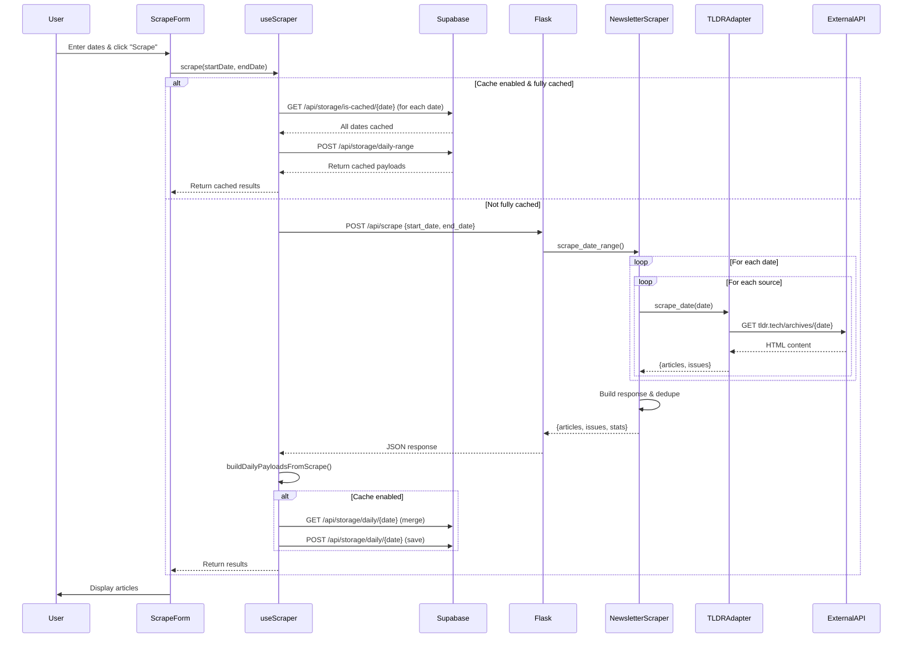

# TLDRScraper Architecture Documentation

## Overview

TLDRScraper is a newsletter aggregator that scrapes tech newsletters from multiple sources, displays them in a unified interface, and provides AI-powered TLDRs. The architecture follows a React 19 + Vite frontend communicating with a Flask backend via REST API, with all state and cache data persisted server-side in Supabase PostgreSQL.

## Technology Stack

**Frontend:**
- React 19
- Vite (build tool)
- Tailwind CSS v4 (utility-first CSS framework)
- Marked.js (markdown parsing)
- DOMPurify (XSS sanitization)

**Backend:**
- Flask (Python web framework)
- Supabase PostgreSQL (database for all state/cache persistence)
- curl_cffi (web scraping)
- Jina Reader API (web scraping fallback)
- Firecrawl API (web scraping fallback, optional)
- MarkItDown (HTML → Markdown conversion)
- OpenAI GPT-5 (AI TLDRs)

## Architecture Diagram

```plaintext
┌─────────────────────────────────────────────────────────────────────────┐
│                             User Browser                                 │
│  ┌───────────────────────────────────────────────────────────────────┐  │
│  │                       React 19 Application                        │  │
│  │  ┌────────────┐  ┌──────────────┐  ┌──────────────────────────┐  │  │
│  │  │  App.jsx   │  │ Components   │  │    Hooks                 │  │  │
│  │  │            │  │              │  │                          │  │  │
│  │  │  - Root    │  │ - ScrapeForm │  │ - useArticleState        │  │  │
│  │  │  - Hydrate │  │ - CacheToggle│  │ - useSummary             │  │  │
│  │  │  - Results │  │ - Results    │  │ - useSupabaseStorage     │  │  │
│  │  │    Display │  │   Display    │  │                          │  │  │
│  │  │            │  │ - ArticleList│  │ Lib                      │  │  │
│  │  │            │  │ - ArticleCard│  │ - scraper.js             │  │  │
│  │  │            │  │ - Feed        │  │ - storageApi.js          │  │  │
│  │  └────────────┘  └──────────────┘  └──────────────────────────┘  │  │
│  └───────────────────────────────────────────────────────────────────┘  │
└─────────────────────────────────────────────────────────────────────────┘
                                    │
                                    │ HTTP REST API
                                    ▼
┌─────────────────────────────────────────────────────────────────────────┐
│                          Flask Backend (Python)                          │
│  ┌───────────────────────────────────────────────────────────────────┐  │
│  │                         serve.py (Routes)                         │  │
│  │  POST /api/scrape             POST /api/tldr-url                 │  │
│  │  GET/POST /api/storage/setting/<key>                             │  │
│  │  GET/POST /api/storage/daily/<date>                              │  │
│  │  POST /api/storage/daily-range                                   │  │
│  │  GET /api/storage/is-cached/<date>                               │  │
│  │  POST /api/generate-context                                      │  │
│  └───────────────────────────────────────────────────────────────────┘  │
│                                    │                                     │
│                                    ▼                                     │
│  ┌───────────────────────────────────────────────────────────────────┐  │
│  │                       tldr_app.py (App Logic)                     │  │
│  │  - scrape_newsletters()    - tldr_url()                           │  │
│  │  - get_tldr_prompt_template()                                    │  │
│  └───────────────────────────────────────────────────────────────────┘  │
│                                    │                                     │
│                                    ▼                                     │
│  ┌───────────────────────────────────────────────────────────────────┐  │
│  │                    tldr_service.py (Service Layer)                │  │
│  │  - scrape_newsletters_in_date_range()                             │  │
│  │  - tldr_url_content()                                             │  │
│  └───────────────────────────────────────────────────────────────────┘  │
│  ┌───────────────────────────────────────────────────────────────────┐  │
│  │                 storage_service.py (Storage Layer)                │  │
│  │  - get_setting() / set_setting()                                  │  │
│  │  - get_daily_payload() / set_daily_payload()                      │  │
│  │  - get_daily_payloads_range() / is_date_cached()                  │  │
│  └───────────────────────────────────────────────────────────────────┘  │
│              │                            │                              │
│              ▼                            ▼                              │
│  ┌────────────────────────┐   ┌──────────────────────────────────────┐ │
│  │  newsletter_scraper.py │   │       summarizer.py                  │ │
│  │                        │   │                                      │ │
│  │  - scrape_date_range() │   │  - tldr_url()                       │ │
│  │  - Adapter Factory     │   │  - url_to_markdown()                │ │
│  │                        │   │  - scrape_url()                     │ │
│  │  22 Adapter Classes:   │   │  - _call_llm()                      │ │
│  │  TLDR, HackerNews,     │   │                                      │ │
│  │  Anthropic, Stripe,    │   │                                      │ │
│  │  Simon Willison, etc.  │   │                                      │ │
│  └────────────────────────┘   └──────────────────────────────────────┘ │
└─────────────────────────────────────────────────────────────────────────┘
                                    │
                                    ▼
┌─────────────────────────────────────────────────────────────────────────┐
│                   Database & External Services                           │
│  ┌──────────────────────────────────────────────────────────────────┐  │
│  │  Supabase PostgreSQL Database                                    │  │
│  │  - settings table (key-value for cache:enabled, etc.)            │  │
│  │  - daily_cache table (JSONB payloads by date)                    │  │
│  └──────────────────────────────────────────────────────────────────┘  │
│  ┌──────────────┐  ┌──────────────┐  ┌────────────────────────────┐   │
│  │  TLDR News   │  │ HackerNews   │  │  OpenAI GPT-5 API          │   │
│  │  Newsletter  │  │  API         │  │  (Summaries & TLDRs)       │   │
│  │  Archives    │  │              │  │                            │   │
│  └──────────────┘  └──────────────┘  └────────────────────────────┘   │
│  ┌──────────────┐  ┌──────────────┐  ┌────────────────────────────┐   │
│  │  Jina Reader │  │  curl_cffi   │  │  Firecrawl API             │   │
│  │  r.jina.ai   │  │  (Chrome)    │  │  api.firecrawl.dev         │   │
│  └──────────────┘  └──────────────┘  └────────────────────────────┘   │
└─────────────────────────────────────────────────────────────────────────┘
```

---

## Features & User Interactions

### 1. Newsletter Scraping
**User Action:** Enter start/end dates → Click "Scrape Newsletters"

**Available Interactions:**
- Select date range (max 31 days)
- Submit scrape request
- View progress bar
- View results grouped by date/issue

### 2. Cache Management
**User Action:** Toggle cache checkbox

**Available Interactions:**
- Enable/disable cache
- State persists in Supabase settings table

### 3. Article State Management
**User Action:** Click article link / Remove button / Restore button

**Available Interactions:**
- Click article title → Mark as read
- Click "Remove" → Mark as removed (visual strikethrough, subtitle hidden)
- Click "Restore" → Restore removed article
- Trash icon always visible on mobile devices
- Article states persist in Supabase daily_cache table

### 4. TLDR Generation
**User Action:** Click "TLDR" button on article

**Available Interactions:**
- Click "TLDR" → Fetch TLDR from API
- TLDR displayed inline below article
- Click again → Collapse TLDR
- Cached TLDRs show "Available" (green)

### 5. Results Display with Feed Component
**User Action:** View scraped results

**Available Interactions:**
- Feed component with DailyGroup subcomponents (one per date)
- DailyGroup features:
  - Live sync with Supabase via useSupabaseStorage hook
  - Sticky date header with "Syncing..." indicator during updates
  - Articles grouped by: Date → Issue/Category → Section
  - "Other" section for uncategorized articles
- Articles sorted by state: Unread → Read → Removed
- Visual state indicators (bold = unread, muted = read, strikethrough = removed)
- Stats display (article count, unique URLs, dates processed)
- Collapsible debug logs

### 6. Context Generation (Development Tool)
**User Action:** Call POST /api/generate-context endpoint

**Available Modes:**
- `server`: Extract Python server code with optional AST-only mode
- `client`: Extract all client-side code (JSX, JS, CSS, HTML)
- `docs`: Extract all markdown documentation
- `all`: Concatenate all three contexts

**Output Format:** XML with file paths and contents for LLM consumption

### 7. Tailwind CSS v4 Configuration
**Configuration Method:** CSS-first via `@theme` directive in index.css

**Custom Design Tokens:**
- Font stacks: `--font-sans` (SF Pro Text), `--font-display` (SF Pro Display)
- Brand colors: Sky blue palette (brand-50 through brand-900)
- Shadows: `--shadow-soft`, `--shadow-soft-hover`

**Note:** No tailwind.config.js file - Tailwind v4 uses CSS-based configuration

---

## State Machines

### Feature 1: Newsletter Scraping

#### States
1. **idle** - No scraping in progress
2. **validating** - Validating date range input
3. **checking_cache** - Checking if range is fully cached
4. **fetching_api** - Calling backend API
5. **merging_cache** - Merging API results with Supabase cache
6. **complete** - Results displayed
7. **error** - Error occurred

#### State Transitions

```
idle
  │
  ├─ User enters dates
  │    ↓
  │  validating
  │    │
  │    ├─ Valid dates
  │    │    ↓
  │    │  checking_cache
  │    │    │
  │    │    ├─ Fully cached & cache enabled
  │    │    │    ↓
  │    │    │  loading_cache (GET /api/storage/daily-range)
  │    │    │    ↓
  │    │    │  complete (load from Supabase)
  │    │    │
  │    │    └─ Not fully cached OR cache disabled
  │    │         ↓
  │    │       fetching_api
  │    │         │
  │    │         ├─ Success
  │    │         │    ↓
  │    │         │  merging_cache (if cache enabled)
  │    │         │    ↓ POST /api/storage/daily/{date}
  │    │         │  complete
  │    │         │
  │    │         └─ Failure
  │    │              ↓
  │    │            error
  │    │
  │    └─ Invalid dates
  │         ↓
  │       error (validation error)
  │
  └─ (loop back to idle on next interaction)
```

#### Key State Data
- **startDate**: string (ISO date)
- **endDate**: string (ISO date)
- **loading**: boolean
- **progress**: number (0-100)
- **error**: string | null
- **results**: ResultsPayload | null

---

### Feature 2: Cache Management

#### States
1. **enabled** - Cache is active
2. **disabled** - Cache is inactive

#### State Transitions

```
enabled
  │
  ├─ User toggles OFF
  │    ↓
  │  disabled
  │    │
  │    └─ POST /api/storage/setting/cache:enabled {value: false}
  │         ↓ Supabase upsert to settings table
  │
  └─ User toggles ON
       ↓
     enabled
       │
       └─ POST /api/storage/setting/cache:enabled {value: true}
            ↓ Supabase upsert to settings table
```

#### Key State Data
- **enabled**: boolean (reactive, synced to Supabase settings table)
- **loading**: boolean (during database read/write)
- **statusText**: computed string ("(enabled)" | "(disabled)")

---

### Feature 3: Article State Management

#### States (per article)
1. **unread** - Default state, bold text
2. **read** - User clicked/viewed, muted text
3. **removed** - User removed, strikethrough + dashed border

#### State Transitions

```
unread
  │
  ├─ User clicks article link
  │    ↓
  │  read
  │    │
  │    ├─ article.read = { isRead: true, markedAt: timestamp }
  │    │
  │    └─ POST /api/storage/daily/{date} → Supabase upsert
  │
  ├─ User clicks "Remove"
  │    ↓
  │  removed
  │    │
  │    ├─ article.removed = true
  │    │
  │    └─ POST /api/storage/daily/{date} → Supabase upsert
  │
read
  │
  └─ User clicks "Remove"
       ↓
     removed
       │
       ├─ article.removed = true
       │
       └─ POST /api/storage/daily/{date} → Supabase upsert

removed
  │
  └─ User clicks "Restore"
       ↓
     unread (or previous state)
       │
       ├─ article.removed = false
       │
       └─ POST /api/storage/daily/{date} → Supabase upsert
```

#### Key State Data (per article)
- **url**: string (unique identifier)
- **issueDate**: string (storage key component)
- **read**: { isRead: boolean, markedAt: string | null }
- **removed**: boolean

---

### Feature 4: TLDR Generation

#### States (per article TLDR)
1. **unknown** - TLDR not yet requested
2. **creating** - API request in progress
3. **available** - TLDR cached and ready
4. **error** - API request failed

#### State Transitions

```
unknown
  │
  └─ User clicks "TLDR"
       ↓
     creating
       │
       ├─ POST /api/tldr-url { url, summary_effort }
       │
       ├─ Success
       │    ↓
       │  available
       │    │
       │    ├─ tldr.status = 'available'
       │    ├─ tldr.markdown = response.tldr_markdown
       │    ├─ tldr.expanded = true
       │    ├─ Mark article as read
       │    │
       │    └─ POST /api/storage/daily/{date} → Supabase upsert
       │
       └─ Failure
            ↓
          error
            │
            ├─ tldr.status = 'error'
            ├─ tldr.errorMessage = error text
            │
            └─ POST /api/storage/daily/{date} → Supabase upsert

available
  │
  └─ User clicks "Available"
       ↓
     (toggle expanded state, no API call)
```

#### Key State Data (per article)
- **tldr.status**: 'unknown' | 'creating' | 'available' | 'error'
- **tldr.markdown**: string
- **tldr.html**: computed (marked + DOMPurify)
- **tldr.effort**: 'minimal' | 'low' | 'medium' | 'high'
- **tldr.expanded**: boolean (UI state)
- **tldr.errorMessage**: string | null

---

## Call Graphs

### Feature 1: Newsletter Scraping - Complete Flow

#### Client → Backend → External Services

```
User clicks "Scrape Newsletters"
  │
  ├─ ScrapeForm.jsx handleSubmit()
  │    │
  │    ├─ Check validation
  │    │    │
  │    │    └─ If invalid: return early
  │    │
  │    └─ Call scraper.scrape(startDate, endDate)
  │
  └─ scraper.js scrape(startDate, endDate)
       │
       ├─ Reset state:
       │    - loading.value = true
       │    - progress.value = 0
       │    - error.value = null
       │
       ├─ Step 1: Check cache
       │    │
  │    └─ scraper.js isRangeCached(startDate, endDate)
  │         │
  │         ├─ Compute date range: computeDateRange()
  │         │    │
  │         │    └─ Returns: ['2024-01-03', '2024-01-02', '2024-01-01']
  │         │
  │         └─ Check each date in Supabase:
  │              │
  │              └─ GET /api/storage/is-cached/2024-01-01
  │                   │
  │                   ├─ If ALL dates cached AND cacheEnabled = true
  │                   │    │
  │                   │    └─ scraper.js loadFromCache()
  │                   │         │
  │                   │         ├─ POST /api/storage/daily-range
  │                   │         ├─ Build stats: buildStatsFromPayloads()
  │                   │         ├─ Update progress state
  │                   │         │
  │                   │         └─ Return cached results
       │                   │
       │                   └─ If NOT fully cached OR cache disabled
       │                        │
       │                        └─ Continue to API call...
       │
       ├─ Step 2: API Call
       │    │
       │    ├─ progress.value = 50
       │    │
       │    └─ window.fetch('/api/scrape', {
       │         method: 'POST',
       │         body: JSON.stringify({ start_date, end_date })
       │       })
       │         │
       │         └─ Server receives request...
       │              │
       │              ├─ serve.py:36 scrape_newsletters_in_date_range()
       │              │    │
       │              │    ├─ Extract request.get_json()
       │              │    │    - start_date: "2024-01-01"
       │              │    │    - end_date: "2024-01-03"
       │              │    │    - sources: null (optional)
       │              │    │
       │              │    └─ tldr_app.py:9 scrape_newsletters(start_date, end_date, source_ids, excluded_urls=[])
       │              │         │
       │              │         └─ tldr_service.py:43 scrape_newsletters_in_date_range()
       │              │              │
       │              │              ├─ tldr_service.py:17 _parse_date_range()
       │              │              │    │
       │              │              │    ├─ Parse ISO dates
       │              │              │    ├─ Validate: start <= end
       │              │              │    ├─ Validate: range < 31 days
       │              │              │    │
       │              │              │    └─ Return (datetime, datetime)
       │              │              │
       │              │              └─ newsletter_scraper.py:307 scrape_date_range(start_date, end_date, source_ids, excluded_urls)
       │              │                   │
       │              │                   ├─ util.get_date_range(start, end)
       │              │                   │    │
       │              │                   │    └─ Returns list of dates: [date1, date2, date3]
       │              │                   │
       │              │                   ├─ Default sources: NEWSLETTER_CONFIGS.keys()
       │              │                   │    - ['tldr_tech', 'tldr_ai', 'hackernews', ...]
       │              │                   │
       │              │                   ├─ Initialize tracking:
       │              │                   │    - all_articles = []
       │              │                   │    - url_set = set()
       │              │                   │    - issue_metadata_by_key = {}
       │              │                   │
       │              │                   └─ For each date in dates:
       │              │                        │
       │              │                        └─ For each source_id in source_ids:
       │              │                             │
       │              │                             ├─ newsletter_scraper.py:231 _collect_newsletters_for_date_from_source()
       │              │                             │    │
       │              │                             │    ├─ newsletter_scraper.py:15 _get_adapter_for_source(config)
       │              │                             │    │    │
       │              │                             │    │    └─ Factory returns adapter based on source_id:
       │              │                             │    │         - tldr_* → TLDRAdapter
       │              │                             │    │         - hackernews → HackerNewsAdapter
       │              │                             │    │         - 20 other sources → respective adapters
       │              │                             │    │
       │              │                             │    └─ adapter.scrape_date(date, excluded_urls)
       │              │                             │         │
       │              │                             │         ├─ TLDRAdapter: Scrapes tldr.tech archives
       │              │                             │         │    │
       │              │                             │         │    ├─ Build URL: f"https://tldr.tech/{newsletter_type}/archives/{date}"
       │              │                             │         │    ├─ HTTP GET request
       │              │                             │         │    ├─ Parse HTML for articles
       │              │                             │         │    ├─ Extract metadata from titles: "(N minute read)" or "(GitHub Repo)" → article_meta field
       │              │                             │         │    ├─ Filter out excluded URLs
       │              │                             │         │    │
       │              │                             │         │    └─ Return { articles: [...], issues: [...] }
       │              │                             │         │
       │              │                             │         └─ HackerNewsAdapter: Scrapes HN API (Algolia)
       │              │                             │              │
       │              │                             │              ├─ Fetch 50 stories from Algolia (pre-filtered by date/score)
       │              │                             │              ├─ Filter out excluded URLs (canonical matching)
       │              │                             │              ├─ Calculate leading scores: (2 × upvotes) + comments
       │              │                             │              ├─ Sort by leading score descending
       │              │                             │              ├─ Convert top stories to articles
       │              │                             │              ├─ Extract metadata: "N upvotes, K comments" → article_meta field
       │              │                             │              │
       │              │                             │              └─ Return { articles: [...], issues: [] }
       │              │                             │
       │              │                             ├─ For each article in result:
       │              │                             │    │
       │              │                             │    ├─ Canonicalize URL
       │              │                             │    ├─ Deduplicate via url_set
       │              │                             │    │
       │              │                             │    └─ Append to all_articles
       │              │                             │
       │              │                             └─ Sleep 0.2s (rate limiting)
       │              │
       │              ├─ newsletter_scraper.py:198 _build_scrape_response()
       │              │    │
       │              │    ├─ Group articles by date
       │              │    ├─ Build markdown output (newsletter_merger.py)
       │              │    ├─ Build issues list
       │              │    ├─ Compute stats
       │              │    │
       │              │    └─ Return {
       │              │         success: true,
       │              │         articles: [...],
       │              │         issues: [...],
       │              │         stats: { total_articles, unique_urls, ... }
       │              │       }
       │              │
       │              └─ Flask jsonify() → HTTP Response
       │
       ├─ Step 3: Process Response
       │    │
  │    └─ scraper.js buildDailyPayloadsFromScrape(data)
  │         │
  │         ├─ Group articles by date
  │         ├─ Group issues by date
  │         │
  │         └─ Build daily payloads: [{
  │              date: "2024-01-01",
  │              articles: [...],
  │              issues: [...],
  │              cachedAt: timestamp
  │            }]
  │
  ├─ Step 4: Merge with Cache (if enabled)
  │    │
  │    └─ scraper.js mergeWithCache(payloads)
  │         │
  │         └─ For each payload:
  │              │
  │              ├─ GET /api/storage/daily/{date}
  │              │    │
  │              │    ├─ If cached data exists:
  │              │    │    │
  │              │    │    └─ Merge articles (preserve tldr, read, removed, tldrHidden)
  │              │    │
  │              │    └─ POST /api/storage/daily/{date} (save to Supabase)
  │              │
  │              └─ Return merged payload
  │
  ├─ Step 5: Update State
  │    │
  │    ├─ Update progress state
  │    ├─ Set results state: { success, payloads, source, stats }
  │    │
  │    └─ Return results
  │
  └─ Step 6: Display Results
       │
       └─ ScrapeForm.jsx passes results via callback
            │
            └─ App.jsx handleResults(data)
                 │
                 ├─ Update results state
                 │
                 └─ ResultsDisplay.jsx renders:
                      │
                      ├─ Stats
                      ├─ Debug logs
                      │
                      └─ ArticleList (grouped by date/issue)
                           │
                           └─ ArticleCard (for each article)
```

---

### Feature 4: TLDR Generation - Complete Flow

```
User clicks "TLDR" button
  │
  ├─ ArticleCard.jsx onClick={handleTldrClick}
  │    │
  │    └─ useSummary hook toggle()
  │         │
  │         ├─ Check if TLDR already available
  │         │
  │         └─ useSummary.js fetch(summaryEffort)
  │                   │
  │                   └─ window.fetch('/api/tldr-url', {
  │                        method: 'POST',
  │                        body: JSON.stringify({ url, summary_effort })
  │                      })
  │                        │
  │                        └─ Server receives request...
  │                             │
  │                             ├─ serve.py:72 tldr_url()
  │                             │    │
  │                             │    └─ tldr_app.py:32 tldr_url(url, summary_effort)
  │                             │         │
  │                             │         └─ tldr_service.py:79 tldr_url_content(url, summary_effort)
  │                             │              │
  │                             │              ├─ util.canonicalize_url(url)
  │                             │              │
  │                             │              └─ summarizer.py:279 tldr_url(url, summary_effort)
  │                             │                   │
  │                             │                   ├─ url_to_markdown(url)
  │                             │                   │    (scrapes and converts URL content to markdown)
  │                             │                   │
  │                             │                   ├─ Fetch TLDR prompt template:
  │                             │                   │    │
  │                             │                   │    └─ _fetch_tldr_prompt()
  │                             │                   │         │
  │                             │                   │         └─ Fetch from GitHub:
  │                             │                   │              "https://api.github.com/repos/giladbarnea/llm-templates/contents/text/tldr.md"
  │                             │                   │
  │                             │                   ├─ Build prompt:
  │                             │                   │    template + "\n\n<tldr this>\n" + markdown + "\n</tldr this>"
  │                             │                   │
  │                             │                   └─ Call LLM:
  │                             │                        │
  │                             │                        └─ _call_llm(prompt, summary_effort)
  │                             │                             (calls OpenAI GPT-5 API)
  │                             │
  │                             └─ Return { success, tldr_markdown, canonical_url, summary_effort }
  │
  └─ Client receives response:
       │
       ├─ Update article state:
       │    {
       │      status: 'available',
       │      markdown: result.tldr_markdown,
       │      effort: summaryEffort,
       │      checkedAt: timestamp,
       │      errorMessage: null
       │    }
       │
       ├─ Set expanded state to true
       ├─ Mark article as read (if not already)
       │
       └─ Display inline TLDR
```

---

## Data Structures

### DailyPayload (Supabase: `daily_cache` table, keyed by date)

```typescript
{
  date: string,              // "2024-01-01"
  cachedAt: string,          // ISO timestamp
  articles: Article[],       // Array of articles for this date
  issues: Issue[]            // Array of newsletter issues for this date
}
```

### Article

```typescript
{
  url: string,               // Canonical URL (unique identifier)
  title: string,
  articleMeta: string,       // Metadata extracted from source (e.g., "158 upvotes, 57 comments" or "5 minute read")
  issueDate: string,         // "2024-01-01"
  category: string,          // "TLDR Tech", "HackerNews", etc.
  sourceId: string,          // "tldr_tech", "hackernews"
  section: string | null,    // Section title within newsletter
  sectionEmoji: string | null,
  sectionOrder: number | null,
  newsletterType: string | null,

  // User state
  removed: boolean,
  tldrHidden: boolean,      // When user collapses TLDR after reading
  read: {
    isRead: boolean,
    markedAt: string | null  // ISO timestamp
  },

  // AI-generated content
  tldr: {
    status: 'unknown' | 'creating' | 'available' | 'error',
    markdown: string,
    effort: 'minimal' | 'low' | 'medium' | 'high',
    checkedAt: string | null,
    errorMessage: string | null
  }
}
```

### Issue

```typescript
{
  date: string,              // "2024-01-01"
  source_id: string,         // "tldr_tech"
  category: string,          // "TLDR Tech"
  title: string | null,      // Issue title
  subtitle: string | null    // Issue subtitle
}
```

### ScrapeRequest (POST /api/scrape)

```typescript
{
  start_date: string,        // "2024-01-01"
  end_date: string,          // "2024-01-03"
  sources?: string[]         // ["tldr_tech", "hackernews"] (optional)
}
```

### ScrapeResponse (API response)

```typescript
{
  success: boolean,
  articles: Article[],       // All articles (flattened)
  issues: Issue[],           // All issues
  stats: {
    total_articles: number,
    unique_urls: number,
    dates_processed: number,
    dates_with_content: number,
    network_fetches: number,
    cache_mode: string,
    debug_logs: string[]
  },
  output: string             // Markdown formatted output
}
```

---

## Component Dependency Graph

```
App.jsx
  │
  ├── CacheToggle.jsx
  │     └── useSupabaseStorage('cache:enabled')
  │           └── GET/POST /api/storage/setting/cache:enabled
  │
  ├── ScrapeForm.jsx
  │     └── scraper.js functions
  │           └── storageApi.js (GET/POST /api/storage/daily/*)
  │
  └── Feed.jsx
        │
        └── DailyGroup (per date)
              │
              ├── useSupabaseStorage('newsletters:scrapes:{date}')
              │     └── GET/POST /api/storage/daily/{date}
              │
              └── ArticleList.jsx
                    │
                    └── ArticleCard.jsx
                          ├── useArticleState(date, url)
                          │     └── useSupabaseStorage('newsletters:scrapes:{date}')
                          │           └── GET/POST /api/storage/daily/{date}
                          │
                          └── useSummary(date, url)
                                └── useArticleState(date, url)
```

---

## Sequence Diagram: Full Scraping Flow



---

## Key Algorithms

### 1. Article Sorting Algorithm (ArticleList.jsx)

```javascript
// Sort articles by state (unread → read → removed), then by original order
function sortArticles(articles) {
  return articles.sort((a, b) => {
    const stateA = getArticleState(a)  // 0=unread, 1=read, 2=removed
    const stateB = getArticleState(b)

    // Primary sort: by state
    if (stateA !== stateB) return stateA - stateB

    // Secondary sort: preserve original order within same state
    return (a.originalOrder ?? 0) - (b.originalOrder ?? 0)
  })
}
```

### 2. Date Range Computation (scraper.js)

```javascript
// Compute all dates between start and end (inclusive, descending)
function computeDateRange(startDate, endDate) {
  const dates = []
  const start = new Date(startDate)
  const end = new Date(endDate)

  const current = new Date(end)
  while (current >= start) {
    dates.push(current.toISOString().split('T')[0])
    current.setDate(current.getDate() - 1)
  }

  return dates  // ['2024-01-03', '2024-01-02', '2024-01-01']
}
```

### 3. Cache Merge Algorithm (scraper.js)

```javascript
// Merge new scrape results with existing cached data from Supabase
async function mergeWithCache(payloads) {
  const merged = []

  for (const payload of payloads) {
    const existing = await storageApi.getDailyPayload(payload.date)

    if (existing) {
      // Merge: preserve user state (read, removed, tldrHidden) and AI content (tldr)
      const mergedPayload = {
        ...payload,
        articles: payload.articles.map(article => {
          const existingArticle = existing.articles?.find(a => a.url === article.url)
          return existingArticle
            ? { ...article, tldr: existingArticle.tldr,
                read: existingArticle.read, removed: existingArticle.removed, tldrHidden: existingArticle.tldrHidden }
            : article
        })
      }
      await storageApi.setDailyPayload(payload.date, mergedPayload)
      merged.push(mergedPayload)
    } else {
      await storageApi.setDailyPayload(payload.date, payload)
      merged.push(payload)
    }
  }

  return merged
}
```

### 4. URL Deduplication (newsletter_scraper.py:231)

```python
# Deduplicate articles across sources using canonical URLs
url_set = set()
all_articles = []

for article in scraped_articles:
    canonical_url = util.canonicalize_url(article['url'])
    article['url'] = canonical_url

    if canonical_url not in url_set:
        url_set.add(canonical_url)
        all_articles.append(article)
```

---

## Database Schema (Supabase PostgreSQL)

### Table: settings

```sql
CREATE TABLE settings (
  key TEXT PRIMARY KEY,
  value JSONB NOT NULL,
  updated_at TIMESTAMPTZ DEFAULT NOW()
);

-- Example row:
{ key: 'cache:enabled', value: true, updated_at: '2024-01-01T12:00:00Z' }
```

### Table: daily_cache

```sql
CREATE TABLE daily_cache (
  date DATE PRIMARY KEY,
  payload JSONB NOT NULL,
  cached_at TIMESTAMPTZ DEFAULT NOW()
);

-- Example row:
{
  date: '2024-01-01',
  payload: {
    date: '2024-01-01',
    cachedAt: '2024-01-01T12:00:00Z',
    articles: [{url, title, read, removed, tldr, ...}, ...],
    issues: [{date, source_id, category, ...}, ...]
  },
  cached_at: '2024-01-01T12:00:00Z'
}
```

### Storage Flow

1. **Initial Scrape**: API response → Build payloads → POST /api/storage/daily/{date} → Supabase upsert
2. **Cache Hit**: GET /api/storage/daily-range → Read from Supabase → Skip scrape API call
3. **User Interaction**: Modify article state → POST /api/storage/daily/{date} → Supabase upsert → Dispatches 'supabase-storage-change' event
4. **Summary/TLDR**: Fetch from API → Update article → POST /api/storage/daily/{date} → Supabase upsert

### Storage Key Patterns

- **Settings**: `cache:*` (e.g., `cache:enabled`)
- **Daily Payloads**: `newsletters:scrapes:{date}` (e.g., `newsletters:scrapes:2024-01-01`)
- Keys are used by `useSupabaseStorage` hook to route to correct endpoint

### Client-Side Caching

Three-tier cache strategy in `useSupabaseStorage`:
1. **readCache**: In-memory Map for instant access
2. **inflightReads**: Deduplicates simultaneous requests for same key
3. **Network fetch**: Falls back to API if not cached
- Change listeners enable cross-component synchronization
- CustomEvent dispatched on storage changes for cross-tab sync

---

## Error Handling

### Frontend Errors

1. **Validation Errors**
   - Date range > 31 days → Show inline error
   - Start date > end date → Show inline error

2. **Network Errors**
   - API unreachable → Show error message
   - Timeout → Show error message

3. **Summary/TLDR Errors**
   - Scraping failed → summary.status = 'error'
   - LLM API failed → summary.errorMessage = "..."
   - Button shows "Retry" instead of "Available"

### Backend Errors

1. **Scraping Errors**
   - Individual source failures → Log warning, continue with other sources
   - All sources fail → Return partial results

2. **Summary/TLDR Errors**
   - Try multiple scraping methods (curl_cffi → Jina Reader → Firecrawl)
   - Return 502 on network errors
   - Return 500 on LLM errors

---

## Performance Considerations

1. **Caching Strategy**
   - Cache at daily granularity (not per-source)
   - Merge strategy preserves user state and AI content
   - Cache check before every API call

2. **Rate Limiting**
   - 0.2s delay between source scrapes
   - Prevents overwhelming external APIs

3. **Lazy Loading**
   - Summaries/TLDRs fetched on-demand
   - Not included in initial scrape
   - Cached after first fetch

4. **Component Optimization**
   - Scoped CSS modules prevent style leakage
   - useMemo caches derived state
   - Conditional rendering optimizes DOM updates

---

## Security Measures

1. **XSS Prevention**
   - DOMPurify sanitizes all markdown → HTML conversions
   - dangerouslySetInnerHTML only used with sanitized content

2. **CSRF Protection**
   - Same-origin policy (frontend served from same domain)

3. **Input Validation**
   - Date range validation (client + server)
   - URL canonicalization (prevents cache poisoning)

4. **API Key Management**
   - OpenAI API key server-side only
   - GitHub token for private repos (optional)
   - Firecrawl API key for hard-to-scrape sites (optional)

---

## Testing Considerations

### Unit Tests (Frontend)

- `scraper.js`: Date range computation, cache hit/miss logic
- `useArticleState.js`: State mutations (read/unread/removed)
- `useSummary.js`: Toggle expansion, fetch logic

### Integration Tests

- Full scraping flow (API → cache → display)
- Summary generation end-to-end
- Cache merge behavior

### E2E Tests

- User scrapes date range → Views results
- User marks article as read → State persists
- User generates summary → Summary displays and caches

---

## Future Enhancements

1. **Reasoning Effort Selector**
   - Dropdown on summary button (minimal/low/medium/high)
   - Currently hardcoded to "low"

2. **Source Filtering**
   - UI to select which newsletters to scrape
   - Backend already supports `sources` parameter

3. **Export Functionality**
   - Export articles as markdown/JSON
   - Bulk copy summaries

4. **Search & Filter**
   - Full-text search across articles
   - Filter by category/source/state

---

## File Structure

```
TLDRScraper/
├── client/                    # React 19 frontend
│   ├── src/
│   │   ├── App.jsx           # Root component
│   │   ├── main.jsx          # Entry point
│   │   ├── components/       # UI components
│   │   │   ├── ArticleCard.jsx
│   │   │   ├── ArticleList.jsx
│   │   │   ├── CacheToggle.jsx
│   │   │   ├── Feed.jsx
│   │   │   ├── ResultsDisplay.jsx
│   │   │   └── ScrapeForm.jsx
│   │   ├── hooks/            # Custom React hooks
│   │   │   ├── useArticleState.js
│   │   │   ├── useSupabaseStorage.js
│   │   │   └── useSummary.js
│   │   └── lib/              # Utilities & logic
│   │       ├── scraper.js
│   │       ├── storageApi.js
│   │       └── storageKeys.js
│   ├── index.html
│   ├── vite.config.js
│   └── package.json
│
├── api/                       # Backend entry point
│   └── index.py
│
├── adapters/                  # Newsletter source adapters (23 files: 1 base + 22 sources)
│   ├── __init__.py           # Module marker
│   ├── newsletter_adapter.py # Base adapter class
│   ├── tldr_adapter.py       # TLDR newsletter adapter
│   ├── hackernews_adapter.py # HackerNews adapter
│   └── ... (20 more blog/newsletter adapters)
│
├── serve.py                   # Flask routes
├── tldr_app.py               # Application logic layer
├── tldr_service.py           # Service layer
├── storage_service.py        # Supabase storage operations
├── supabase_client.py        # Supabase client initialization
├── newsletter_scraper.py     # Scraping orchestration
├── summarizer.py             # URL → Summary/TLDR
├── newsletter_merger.py      # Markdown formatting
├── newsletter_config.py      # Source configurations
└── util.py                   # Shared utilities
```

---

## Conclusion

TLDRScraper is a full-stack newsletter aggregator with sophisticated client-side state management, intelligent caching, and AI-powered content summarization. The architecture separates concerns clearly:

- **React hooks** handle reactive state and async storage operations
- **Flask routes** provide clean REST endpoints (scraping + storage)
- **Service/adapter layers** abstract data sources and database operations
- **Supabase PostgreSQL** provides server-side persistence with JSONB storage
- **OpenAI integration** enhances content with AI-powered summaries

The system is designed for extensibility (new newsletter sources via adapters), performance (database caching with cache-first scraping), and user experience (reactive UI with async loading states).
