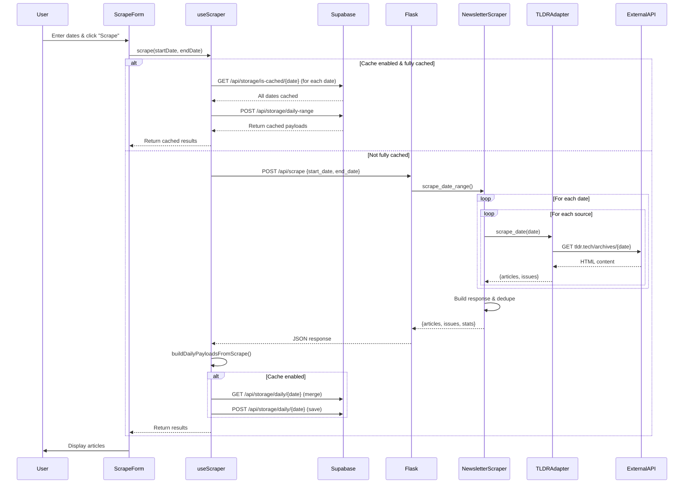

# TLDRScraper Architecture Documentation

## Overview

TLDRScraper is a newsletter aggregator that scrapes tech newsletters from multiple sources, displays them in a unified interface, and provides AI-powered summaries. The architecture follows a React 19 + Vite frontend communicating with a Flask backend via REST API, with all state and cache data persisted server-side in Supabase PostgreSQL.

## Technology Stack

**Frontend:**
- React 19
- Vite (build tool)
- Tailwind CSS v4 (utility-first CSS framework)
- Marked.js (markdown parsing)
- DOMPurify (XSS sanitization)

**Backend:**
- Flask (Python web framework)
- Supabase PostgreSQL (database for all state/cache persistence)
- curl_cffi (web scraping)
- Jina Reader API (web scraping fallback)
- Firecrawl API (web scraping fallback, optional)
- MarkItDown (HTML → Markdown conversion)
- Google Gemini 3 Pro (Generative Language API for summaries)

## Architecture Diagram

```plaintext
┌─────────────────────────────────────────────────────────────────────────┐
│                             User Browser                                 │
│  ┌───────────────────────────────────────────────────────────────────┐  │
│  │                       React 19 Application                        │  │
│  │  ┌────────────┐  ┌──────────────┐  ┌──────────────────────────┐  │  │
│  │  │  App.jsx   │  │ Components   │  │    Hooks                 │  │  │
│  │  │            │  │              │  │                          │  │  │
│  │  │  - Root    │  │ - ScrapeForm │  │ - useArticleState        │  │  │
│  │  │  - Hydrate │  │ - CacheToggle│  │ - useSummary             │  │  │
│  │  │  - Results │  │ - Results    │  │ - useSupabaseStorage     │  │  │
│  │  │    Display │  │   Display    │  │ - useLocalStorage        │  │  │
│  │  │            │  │ - Feed       │  │                          │  │  │
│  │  │            │  │ - CalendarDay│  │ Lib                      │  │  │
│  │  │            │  │ - Newsletter │  │ - scraper.js             │  │  │
│  │  │            │  │   Day        │  │ - storageApi.js          │  │  │
│  │  │            │  │ - ArticleList│  │                          │  │  │
│  │  │            │  │ - ArticleCard│  │                          │  │  │
│  │  └────────────┘  └──────────────┘  └──────────────────────────┘  │  │
│  └───────────────────────────────────────────────────────────────────┘  │
└─────────────────────────────────────────────────────────────────────────┘
                                    │
                                    │ HTTP REST API
                                    ▼
┌─────────────────────────────────────────────────────────────────────────┐
│                          Flask Backend (Python)                          │
│  ┌───────────────────────────────────────────────────────────────────┐  │
│  │                         serve.py (Routes)                         │  │
│  │  POST /api/scrape             POST /api/summarize-url            │  │
│  │  GET/POST /api/storage/setting/<key>                             │  │
│  │  GET/POST /api/storage/daily/<date>                              │  │
│  │  POST /api/storage/daily-range                                   │  │
│  │  GET /api/storage/is-cached/<date>                               │  │
│  └───────────────────────────────────────────────────────────────────┘  │
│                                    │                                     │
│                                    ▼                                     │
│  ┌───────────────────────────────────────────────────────────────────┐  │
│  │                       tldr_app.py (App Logic)                     │  │
│  │  - scrape_newsletters()    - tldr_url()                           │  │
│  │  - get_tldr_prompt_template()                                    │  │
│  └───────────────────────────────────────────────────────────────────┘  │
│                                    │                                     │
│                                    ▼                                     │
│  ┌───────────────────────────────────────────────────────────────────┐  │
│  │                    tldr_service.py (Service Layer)                │  │
│  │  - scrape_newsletters_in_date_range()                             │  │
│  │  - tldr_url_content()                                             │  │
│  └───────────────────────────────────────────────────────────────────┘  │
│  ┌───────────────────────────────────────────────────────────────────┐  │
│  │                 storage_service.py (Storage Layer)                │  │
│  │  - get_setting() / set_setting()                                  │  │
│  │  - get_daily_payload() / set_daily_payload()                      │  │
│  │  - get_daily_payloads_range() / is_date_cached()                  │  │
│  └───────────────────────────────────────────────────────────────────┘  │
│              │                            │                              │
│              ▼                            ▼                              │
│  ┌────────────────────────┐   ┌──────────────────────────────────────┐ │
│  │  newsletter_scraper.py │   │       summarizer.py                  │ │
│  │                        │   │                                      │ │
│  │  - scrape_date_range() │   │  - tldr_url()                       │ │
│  │  - Adapter Factory     │   │  - url_to_markdown()                │ │
│  │                        │   │  - scrape_url()                     │ │
│  │  23 Adapter Classes:   │   │  - _call_llm()                      │ │
│  │  TLDR, HackerNews,     │   │                                      │ │
│  │  Anthropic, Stripe,    │   │                                      │ │
│  │  Simon Willison, etc.  │   │                                      │ │
│  └────────────────────────┘   └──────────────────────────────────────┘ │
└─────────────────────────────────────────────────────────────────────────┘
                                    │
                                    ▼
┌─────────────────────────────────────────────────────────────────────────┐
│                   Database & External Services                           │
│  ┌──────────────────────────────────────────────────────────────────┐  │
│  │  Supabase PostgreSQL Database                                    │  │
│  │  - settings table (key-value for cache:enabled, etc.)            │  │
│  │  - daily_cache table (JSONB payloads by date)                    │  │
│  └──────────────────────────────────────────────────────────────────┘  │
│  ┌──────────────┐  ┌──────────────┐  ┌────────────────────────────┐   │
│  │  TLDR News   │  │ HackerNews   │  │  Google Gemini 3 Pro API   │   │
│  │  Newsletter  │  │  API         │  │  (summaries)               │   │
│  │  Archives    │  │              │  │                            │   │
│  └──────────────┘  └──────────────┘  └────────────────────────────┘   │
│  ┌──────────────┐  ┌──────────────┐  ┌────────────────────────────┐   │
│  │  Jina Reader │  │  curl_cffi   │  │  Firecrawl API             │   │
│  │  r.jina.ai   │  │  (Chrome)    │  │  api.firecrawl.dev         │   │
│  └──────────────┘  └──────────────┘  └────────────────────────────┘   │
└─────────────────────────────────────────────────────────────────────────┘
```

---

## Features & User Interactions

### 1. Newsletter Scraping
**User Action:** Enter start/end dates → Click "Scrape Newsletters"

**Available Interactions:**
- Select date range (max 31 days)
- Submit scrape request
- View progress bar
- View results grouped by date/issue

### 2. Cache Management
**User Action:** Toggle cache checkbox

**Available Interactions:**
- Enable/disable cache
- State persists in Supabase settings table

### 3. Article State Management
**User Action:** Click article link / Remove button / Restore button

**Available Interactions:**
- Click article title → Mark as read
- Click "Remove" → Mark as removed (visual strikethrough, subtitle hidden)
- Click "Restore" → Restore removed article
- Trash icon always visible on mobile devices
- Article states persist in Supabase daily_cache table

### 4. Summary Generation
**User Action:** Click "Summary" button on article OR click article card body

**Available Interactions:**
- Click "Summary" button → Fetch summary from API (if not available) OR toggle visibility (if available)
- Click article card body → Toggle summary visibility (only when summary content already exists)
- Summary displayed inline below article
- Cached summaries show "Available" (green)
- Card shows pointer cursor when summary content is available for toggling

### 5. Results Display with Feed Component
**User Action:** View scraped results

**Available Interactions:**
- Feed component with CalendarDay subcomponents (one per date)
- CalendarDay features:
  - Live sync with Supabase via useSupabaseStorage hook
  - Sticky date header with "Syncing..." indicator during updates
  - Articles grouped by: Date → Issue/Category → Section
  - Newsletters (sources) sorted by rarity: rarest sources displayed at top (based on publishing frequency)
  - "Other" section for uncategorized articles
  - Auto-collapse behavior: Containers automatically collapse in real-time when all child articles are removed
    - Calendar days collapse when all articles for that date are removed
    - Newsletters/categories collapse when all their articles are removed
    - Sections collapse when all their articles are removed
    - Implemented via useEffect hook that detects defaultFolded state transitions
  - Users can manually expand/collapse any container regardless of auto-collapse state
- Articles sorted: Removed articles at bottom, all others maintain original order
- Visual state indicators (bold = unread, muted = read, strikethrough = removed)
- Stats display (article count, unique URLs, dates processed)
- Collapsible debug logs

### 6. Tailwind CSS v4 Configuration
**Configuration Method:** CSS-first via `@theme` directive in index.css

**Custom Design Tokens:**
- Font stacks: `--font-sans` (SF Pro Text), `--font-display` (SF Pro Display)
- Brand colors: Sky blue palette (brand-50 through brand-900)
- Shadows: `--shadow-soft`, `--shadow-soft-hover`

**Note:** No tailwind.config.js file - Tailwind v4 uses CSS-based configuration

---

## State Machines

### Feature 1: Newsletter Scraping

#### States
1. **idle** - No scraping in progress
2. **validating** - Validating date range input
3. **checking_cache** - Checking if range is fully cached
4. **fetching_api** - Calling backend API
5. **merging_cache** - Merging API results with Supabase cache
6. **complete** - Results displayed
7. **error** - Error occurred

#### State Transitions

```
idle
  │
  ├─ User enters dates
  │    ↓
  │  validating
  │    │
  │    ├─ Valid dates
  │    │    ↓
  │    │  checking_cache
  │    │    │
  │    │    ├─ Today in range (regardless of cache state)
  │    │    │    ↓
  │    │    │  fetching_api (cache bypassed to allow server-side union)
  │    │    │
  │    │    ├─ All past dates fully cached & cache enabled
  │    │    │    ↓
  │    │    │  loading_cache (POST /api/storage/daily-range)
  │    │    │    ↓
  │    │    │  complete (load from client cache)
  │    │    │
  │    │    └─ Not fully cached OR cache disabled
  │    │         ↓
  │    │       fetching_api
  │    │
  │    │  fetching_api → Server-side per-date logic:
  │    │    │
  │    │    ├─ Past dates: cache-first (load from Supabase if cached, else scrape)
  │    │    │
  │    │    └─ Today: union logic (cached articles + newly scraped articles)
  │    │         │
  │    │         ├─ Success
  │    │         │    ↓
  │    │         │  merging_cache (client preserves user state: summary, read, removed)
  │    │         │    ↓ POST /api/storage/daily/{date}
  │    │         │  complete
  │    │         │
  │    │         └─ Failure
  │    │              ↓
  │    │            error
  │    │
  │    └─ Invalid dates
  │         ↓
  │       error (validation error)
  │
  └─ (loop back to idle on next interaction)
```

#### Key State Data
- **startDate**: string (ISO date)
- **endDate**: string (ISO date)
- **loading**: boolean
- **progress**: number (0-100)
- **error**: string | null
- **results**: ResultsPayload | null

---

### Feature 2: Cache Management

#### States
1. **enabled** - Cache is active
2. **disabled** - Cache is inactive

#### State Transitions

```
enabled
  │
  ├─ User toggles OFF
  │    ↓
  │  disabled
  │    │
  │    └─ POST /api/storage/setting/cache:enabled {value: false}
  │         ↓ Supabase upsert to settings table
  │
  └─ User toggles ON
       ↓
     enabled
       │
       └─ POST /api/storage/setting/cache:enabled {value: true}
            ↓ Supabase upsert to settings table
```

#### Key State Data
- **enabled**: boolean (reactive, synced to Supabase settings table)
- **loading**: boolean (during database read/write)
- **statusText**: computed string ("(enabled)" | "(disabled)")

---

### Feature 3: Article State Management

#### States (per article)
1. **unread** - Default state, bold text
2. **read** - User clicked/viewed, muted text
3. **removed** - User removed, strikethrough + dashed border

#### State Transitions

```
unread
  │
  ├─ User clicks article link
  │    ↓
  │  read
  │    │
  │    ├─ article.read = { isRead: true, markedAt: timestamp }
  │    │
  │    └─ POST /api/storage/daily/{date} → Supabase upsert
  │
  ├─ User clicks "Remove"
  │    ↓
  │  removed
  │    │
  │    ├─ article.removed = true
  │    │
  │    └─ POST /api/storage/daily/{date} → Supabase upsert
  │
read
  │
  └─ User clicks "Remove"
       ↓
     removed
       │
       ├─ article.removed = true
       │
       └─ POST /api/storage/daily/{date} → Supabase upsert

removed
  │
  └─ User clicks "Restore"
       ↓
     unread (or previous state)
       │
       ├─ article.removed = false
       │
       └─ POST /api/storage/daily/{date} → Supabase upsert
```

#### Key State Data (per article)
- **url**: string (unique identifier)
- **issueDate**: string (storage key component)
- **read**: { isRead: boolean, markedAt: string | null }
- **removed**: boolean

---

### Feature 4: Summary Generation

#### States (per article summary)
1. **unknown** - Summary not yet requested (persisted)
2. **loading** - API request in progress (ephemeral React state, not persisted)
3. **available** - Summary cached and ready (persisted)
4. **error** - API request failed (persisted)

#### State Transitions

```
unknown
  │
  └─ User clicks "Summary"
       ↓
     loading (ephemeral)
       │
       ├─ POST /api/summarize-url { url, summarize_effort }
       │
       ├─ Success
       │    ↓
       │  available
       │    │
       │    ├─ summary.status = 'available'
       │    ├─ summary.markdown = response.summary_markdown
       │    ├─ summary.expanded = true
       │    ├─ Mark article as read
       │    │
       │    └─ POST /api/storage/daily/{date} → Supabase upsert
       │
       └─ Failure
            ↓
          error
            │
            ├─ summary.status = 'error'
            ├─ summary.errorMessage = error text
            │
            └─ POST /api/storage/daily/{date} → Supabase upsert

available
  │
  └─ User clicks "Available"
       ↓
     (toggle expanded state, no API call)
```

#### Key State Data (per article)
- **summary.status**: 'unknown' | 'available' | 'error' (persisted; loading state is ephemeral)
- **summary.markdown**: string
- **summary.html**: computed (marked + DOMPurify)
- **summary.effort**: 'minimal' | 'low' | 'medium' | 'high'
- **summary.expanded**: boolean (UI state)
- **summary.errorMessage**: string | null

---

## Call Graphs

### Feature 1: Newsletter Scraping - Complete Flow

#### Client → Backend → External Services

```
User clicks "Scrape Newsletters"
  │
  ├─ ScrapeForm.jsx handleSubmit()
  │    │
  │    ├─ Check validation
  │    │    │
  │    │    └─ If invalid: return early
  │    │
  │    └─ Call scraper.scrape(startDate, endDate)
  │
  └─ scraper.js scrape(startDate, endDate)
       │
       ├─ Reset state:
       │    - loading.value = true
       │    - progress.value = 0
       │    - error.value = null
       │
       ├─ Step 1: Check cache
       │    │
  │    └─ scraper.js isRangeCached(startDate, endDate)
  │         │
  │         ├─ If today is in range:
  │         │    │
  │         │    └─ Return false immediately (bypass cache to trigger server union)
  │         │
  │         ├─ Compute date range for past dates only
  │         │
  │         └─ Check each date in Supabase:
  │              │
  │              └─ GET /api/storage/is-cached/{date}
  │                   │
  │                   ├─ If ALL dates cached AND cacheEnabled = true
  │                   │    │
  │                   │    └─ scraper.js loadFromCache()
  │                   │         │
  │                   │         ├─ POST /api/storage/daily-range
  │                   │         ├─ Build stats: buildStatsFromPayloads()
  │                   │         │
  │                   │         └─ Return cached results
       │                   │
       │                   └─ If NOT fully cached OR cache disabled
       │                        │
       │                        └─ Continue to API call...
       │
       ├─ Step 2: API Call
       │    │
       │    ├─ progress.value = 50
       │    │
       │    └─ window.fetch('/api/scrape', {
       │         method: 'POST',
       │         body: JSON.stringify({ start_date, end_date })
       │       })
       │         │
       │         └─ Server receives request...
       │              │
       │              ├─ serve.py:36 scrape_newsletters_in_date_range()
       │              │    │
       │              │    ├─ Extract request.get_json()
       │              │    │    - start_date: "2024-01-01"
       │              │    │    - end_date: "2024-01-03"
       │              │    │    - sources: null (optional)
       │              │    │
       │              │    └─ tldr_app.py scrape_newsletters(start_date, end_date, source_ids, excluded_urls=[])
       │              │         │
       │              │         └─ tldr_service.py scrape_newsletters_in_date_range()
       │              │              │
       │              │              ├─ Parse and validate date range (max 31 days)
       │              │              │
       │              │              └─ For each date in range (per-date cache logic):
       │              │                   │
       │              │                   ├─ PAST DATE + CACHED:
       │              │                   │    │
       │              │                   │    └─ storage_service.get_daily_payload(date)
       │              │                   │         → Use cached articles directly (no network)
       │              │                   │
       │              │                   ├─ PAST DATE + NOT CACHED:
       │              │                   │    │
       │              │                   │    └─ newsletter_scraper.scrape_date_range(date, date, ...)
       │              │                   │         → Scrape from sources, add to response
       │              │                   │
       │              │                   └─ TODAY:
       │              │                        │
       │              │                        ├─ Load cached articles from Supabase (if any)
       │              │                        ├─ Extract cached URLs to exclusion set
       │              │                        ├─ Scrape sources with cached URLs excluded
       │              │                        └─ Union: cached articles + newly scraped articles
       │              │
       │              │              newsletter_scraper.scrape_date_range():
       │              │                   │
       │              │                   └─ For each source_id in source_ids:
       │              │                             │
       │              │                             ├─ newsletter_scraper.py:231 _collect_newsletters_for_date_from_source()
       │              │                             │    │
       │              │                             │    ├─ newsletter_scraper.py:15 _get_adapter_for_source(config)
       │              │                             │    │    │
       │              │                             │    │    └─ Factory returns adapter based on source_id:
       │              │                             │    │         - tldr_* → TLDRAdapter
       │              │                             │    │         - hackernews → HackerNewsAdapter
       │              │                             │    │         - 20 other sources → respective adapters
       │              │                             │    │
       │              │                             │    └─ adapter.scrape_date(date, excluded_urls)
       │              │                             │         │
       │              │                             │         ├─ TLDRAdapter: Scrapes tldr.tech archives
       │              │                             │         │    │
       │              │                             │         │    ├─ Build URL: f"https://tldr.tech/{newsletter_type}/archives/{date}"
       │              │                             │         │    ├─ HTTP GET request
       │              │                             │         │    ├─ Parse HTML for articles
       │              │                             │         │    ├─ Extract metadata from titles: "(N minute read)" or "(GitHub Repo)" → article_meta field
       │              │                             │         │    ├─ Filter out excluded URLs
       │              │                             │         │    │
       │              │                             │         │    └─ Return { articles: [...], issues: [...] }
       │              │                             │         │
       │              │                             │         └─ HackerNewsAdapter: Scrapes HN API (Algolia)
       │              │                             │              │
       │              │                             │              ├─ Fetch 50 stories from Algolia (pre-filtered by date/score)
       │              │                             │              ├─ Filter out excluded URLs (canonical matching)
       │              │                             │              ├─ Calculate leading scores: (2 × upvotes) + comments
       │              │                             │              ├─ Sort by leading score descending
       │              │                             │              ├─ Convert top stories to articles
       │              │                             │              ├─ Extract metadata: "N upvotes, K comments" → article_meta field
       │              │                             │              │
       │              │                             │              └─ Return { articles: [...], issues: [] }
       │              │                             │
       │              │                             ├─ For each article in result:
       │              │                             │    │
       │              │                             │    ├─ Canonicalize URL
       │              │                             │    ├─ Deduplicate via url_set
       │              │                             │    │
       │              │                             │    └─ Append to all_articles
       │              │                             │
       │              │                             └─ Sleep 0.2s (rate limiting)
       │              │
       │              ├─ newsletter_scraper.py:198 _build_scrape_response()
       │              │    │
       │              │    ├─ Group articles by date
       │              │    ├─ Build markdown output (newsletter_merger.py)
       │              │    ├─ Build issues list
       │              │    ├─ Compute stats
       │              │    │
       │              │    └─ Return {
       │              │         success: true,
       │              │         articles: [...],
       │              │         issues: [...],
       │              │         stats: { total_articles, unique_urls, ... }
       │              │       }
       │              │
       │              └─ Flask jsonify() → HTTP Response
       │
       ├─ Step 3: Process Response
       │    │
  │    └─ scraper.js buildDailyPayloadsFromScrape(data)
  │         │
  │         ├─ Group articles by date
  │         ├─ Group issues by date
  │         │
  │         └─ Build daily payloads: [{
  │              date: "2024-01-01",
  │              articles: [...],
  │              issues: [...]
  │            }]
  │
  ├─ Step 4: Merge with Cache (if enabled)
  │    │
  │    └─ scraper.js mergeWithCache(payloads)
  │         │
  │         └─ For each payload:
  │              │
  │              ├─ GET /api/storage/daily/{date}
  │              │    │
  │              │    ├─ If cached data exists:
  │              │    │    │
  │              │    │    └─ Merge articles (preserve summary, read, removed)
  │              │    │
  │              │    └─ POST /api/storage/daily/{date} (save to Supabase)
  │              │
  │              └─ Return merged payload
  │
  ├─ Step 5: Update State
  │    │
  │    ├─ Update progress state
  │    ├─ Set results state: { success, payloads, source, stats }
  │    │
  │    └─ Return results
  │
  └─ Step 6: Display Results
       │
       └─ ScrapeForm.jsx passes results via callback
            │
            └─ App.jsx handleResults(data)
                 │
                 ├─ Update results state
                 │
                 └─ ResultsDisplay.jsx renders:
                      │
                      ├─ Stats
                      ├─ Debug logs
                      │
                      └─ ArticleList (grouped by date/issue)
                           │
                           └─ ArticleCard (for each article)
```

---

### Feature 4: Summary Generation - Complete Flow

```
User clicks "Summary" button OR clicks article card body
  │
  ├─ BUTTON CLICK PATH
  │    │
  │    ├─ ArticleCard.jsx onClick={handleExpand}
  │    │    │
  │    │    └─ useSummary hook toggle()
  │    │         │
  │    │         ├─ If summary already available: Toggle visibility only
  │    │         │
  │    │         └─ If summary not available: Fetch from API
  │    │              │
  │    │              └─ window.fetch('/api/summarize-url?model=gemini-3-pro-preview', {
  │    │                   method: 'POST',
  │    │                   body: JSON.stringify({ url, summarize_effort })
  │    │                 })
  │    │                   │
  │    │                   └─ Server receives request...
  │    │                        │
  │    │                        ├─ serve.py:78 summarize_url_endpoint()
  │    │                        │    │
  │    │                        │    └─ tldr_app.py:29 summarize_url(url, summarize_effort)
  │    │                        │         │
  │    │                        │         └─ tldr_service.py:315 summarize_url_content(url, summarize_effort)
  │    │                        │              │
  │    │                        │              ├─ util.canonicalize_url(url)
  │    │                        │              │
  │    │                        │              └─ summarizer.py:286 summarize_url(url, summarize_effort)
  │    │                        │                   │
  │    │                        │                   ├─ url_to_markdown(url)
  │    │                        │                   │    (scrapes and converts URL content to markdown)
  │    │                        │                   │
  │    │                        │                   ├─ Fetch summary prompt template:
  │    │                        │                   │    │
  │    │                        │                   │    └─ _fetch_summary_prompt()
  │    │                        │                   │         │
  │    │                        │                   │         └─ Fetch from GitHub:
  │    │                        │                   │              "https://api.github.com/repos/giladbarnea/llm-templates/contents/text/tldr.md"
  │    │                        │                   │
  │    │                        │                   ├─ Build prompt:
  │    │                        │                   │    template + "\n\n<tldr this>\n" + markdown + "\n</tldr this>"
  │    │                        │                   │
      │    │                        │                   └─ Call LLM:
      │    │                        │                        │
      │    │                        │                        └─ _call_llm(prompt, summarize_effort)
      │    │                        │                             (calls Google Gemini 3 Pro API)
  │    │                        │
  │    │                        └─ Return { success, summary_markdown, canonical_url, summarize_effort }
  │    │
  │    └─ Client receives response:
  │         │
  │         ├─ Update article state:
  │         │    {
  │         │      status: 'available',
  │         │      markdown: result.summary_markdown,
  │         │      effort: summaryEffort,
  │         │      checkedAt: timestamp,
  │         │      errorMessage: null
  │         │    }
  │         │
  │         ├─ Set expanded state to true
  │         ├─ Mark article as read (if not already)
  │         │
  │         └─ Display inline summary
  │
  └─ CARD CLICK PATH
       │
       ├─ ArticleCard.jsx onClick={handleCardClick}
       │    │
       │    └─ useSummary hook toggle()
       │         │
       │         ├─ Only acts if summary content already exists (isAvailable)
       │         └─ Toggles expanded state (no API call)
       │
       └─ Summary content shown/hidden (no server interaction)
```

---

## Data Structures

### DailyPayload (Supabase: `daily_cache` table, keyed by date)

```typescript
{
  date: string,              // "2024-01-01"
  articles: Article[],       // Array of articles for this date
  issues: Issue[]            // Array of newsletter issues for this date
}
```

### Article

```typescript
{
  url: string,               // Canonical URL (unique identifier)
  title: string,
  article_meta: string,      // Metadata extracted from source (e.g., "158 upvotes, 57 comments" or "5 minute read")
  date: string,              // "2024-01-01"
  category: string,          // "TLDR Tech", "HackerNews", etc.
  source_id?: string,        // "tldr_tech", "hackernews"
  section_title?: string,    // Section title within newsletter
  section_emoji?: string,
  section_order?: number,
  newsletter_type?: string,
  removed: boolean
}
```

### Issue

```typescript
{
  date: string,              // "2024-01-01"
  source_id: string,         // "tldr_tech"
  category: string,          // "TLDR Tech"
  title: string | null,      // Issue title
  subtitle: string | null    // Issue subtitle
}
```

### ScrapeRequest (POST /api/scrape)

```typescript
{
  start_date: string,        // "2024-01-01"
  end_date: string,          // "2024-01-03"
  sources?: string[],        // ["tldr_tech", "hackernews"] (optional)
  excluded_urls?: string[]   // canonical URLs to exclude (optional)
}
```

### ScrapeResponse (API response)

```typescript
{
  success: boolean,
  articles: Article[],       // All articles (flattened)
  issues: Issue[],           // All issues
  stats: {
    total_articles: number,
    unique_urls: number,
    dates_processed: number,
    dates_with_content: number,
    network_fetches: number,
    cache_mode: string
  },
  output: string             // Markdown formatted output
}
```

---

## Component Dependency Graph

```
App.jsx
  │
  ├── CacheToggle.jsx
  │     └── useSupabaseStorage('cache:enabled')
  │           └── GET/POST /api/storage/setting/cache:enabled
  │
  ├── ScrapeForm.jsx
  │     └── scraper.js functions
  │           └── storageApi.js (GET/POST /api/storage/daily/*)
  │
  └── Feed.jsx
        │
        └── CalendarDay (per date)
              │
              ├── useSupabaseStorage('newsletters:scrapes:{date}')
              │     └── GET/POST /api/storage/daily/{date}
              │
              ├── FoldableContainer (wraps entire calendar day)
              │     ├── useLocalStorage(id, defaultFolded)
              │     └── defaultFolded={allArticlesRemoved}
              │
              └── NewsletterDay (per newsletter/category)
                    │
                    ├── FoldableContainer (wraps newsletter)
                    │     ├── useLocalStorage(id, defaultFolded)
                    │     └── defaultFolded={allRemoved}
                    │
                    ├── FoldableContainer (wraps each section)
                    │     ├── useLocalStorage(id, defaultFolded)
                    │     └── defaultFolded={sectionAllRemoved}
                    │
                    └── ArticleList.jsx
                          │
                          └── ArticleCard.jsx
                                ├── useArticleState(date, url)
                                │     └── useSupabaseStorage('newsletters:scrapes:{date}')
                                │           └── GET/POST /api/storage/daily/{date}
                                │
                                └── useSummary(date, url)
                                      └── useArticleState(date, url)
```

---

## Sequence Diagram: Full Scraping Flow



---

## Key Algorithms

### 1. Article Sorting Algorithm (ArticleList.jsx)

```javascript
// Sort articles: removed at bottom, all others by original order
function sortArticles(articles) {
  return articles.sort((a, b) => {
    const stateA = a.removed ? 1 : 0
    const stateB = b.removed ? 1 : 0

    // Primary sort: removed articles to bottom
    if (stateA !== stateB) return stateA - stateB

    // Secondary sort: preserve original order
    return (a.originalOrder ?? 0) - (b.originalOrder ?? 0)
  })
}
```

### 2. Date Range Computation (scraper.js)

```javascript
// Compute all dates between start and end (inclusive, descending)
function computeDateRange(startDate, endDate) {
  const dates = []
  const start = new Date(startDate)
  const end = new Date(endDate)

  const current = new Date(end)
  while (current >= start) {
    dates.push(current.toISOString().split('T')[0])
    current.setDate(current.getDate() - 1)
  }

  return dates  // ['2024-01-03', '2024-01-02', '2024-01-01']
}
```

### 3. Cache Merge Algorithm (scraper.js)

```javascript
// Merge new scrape results with existing cached data from Supabase
async function mergeWithCache(payloads) {
  const merged = []

  for (const payload of payloads) {
    const existing = await storageApi.getDailyPayload(payload.date)

    if (existing) {
      // Merge: preserve user state (read, removed) and AI content (summary)
      const mergedPayload = {
        ...payload,
        articles: payload.articles.map(article => {
          const existingArticle = existing.articles?.find(a => a.url === article.url)
          return existingArticle
            ? { ...article, summary: existingArticle.summary,
                read: existingArticle.read, removed: existingArticle.removed }
            : article
        })
      }
      await storageApi.setDailyPayload(payload.date, mergedPayload)
      merged.push(mergedPayload)
    } else {
      await storageApi.setDailyPayload(payload.date, payload)
      merged.push(payload)
    }
  }

  return merged
}
```

### 4. URL Deduplication (newsletter_scraper.py:231)

```python
# Deduplicate articles across sources using canonical URLs
url_set = set()
all_articles = []

for article in scraped_articles:
    canonical_url = util.canonicalize_url(article['url'])
    article['url'] = canonical_url

    if canonical_url not in url_set:
        url_set.add(canonical_url)
        all_articles.append(article)
```

---

## Database Schema (Supabase PostgreSQL)

### Table: settings

```sql
CREATE TABLE settings (
  key TEXT PRIMARY KEY,
  value JSONB NOT NULL,
  updated_at TIMESTAMPTZ DEFAULT NOW()
);

-- Example row:
{ key: 'cache:enabled', value: true, updated_at: '2024-01-01T12:00:00Z' }
```

### Table: daily_cache

```sql
CREATE TABLE daily_cache (
  date DATE PRIMARY KEY,
  payload JSONB NOT NULL,
  cached_at TIMESTAMPTZ DEFAULT NOW()
);

-- Example row:
{
  date: '2024-01-01',
  payload: {
    date: '2024-01-01',
    articles: [{url, title, read, removed, summary, ...}, ...],
    issues: [{date, source_id, category, ...}, ...]
  },
  cached_at: '2024-01-01T12:00:00Z'
}
```

### Storage Flow

1. **Initial Scrape**: API response → Build payloads → POST /api/storage/daily/{date} → Supabase upsert
2. **Cache Hit**: POST /api/storage/daily-range → Read from Supabase → Skip scrape API call
3. **User Interaction**: Modify article state → POST /api/storage/daily/{date} → Supabase upsert → Dispatches 'supabase-storage-change' event
4. **Summary**: Fetch from API → Update article → POST /api/storage/daily/{date} → Supabase upsert
5. **cached_at contract**: Only scrape writes advance cached_at; user-state updates must not mutate cached_at so it remains a scrape freshness signal.

### Storage Key Patterns

- **Settings**: `cache:*` or `ui:*` (e.g., `cache:enabled`)
- **Daily Payloads**: `newsletters:scrapes:{date}` (e.g., `newsletters:scrapes:2024-01-01`)
- **Container Fold State**: Stored in browser localStorage (not Supabase) with keys like `calendar-{date}`, `newsletter-{date}-{title}`, `section-{date}-{title}-{section}`
  - FoldableContainer uses `useLocalStorage` hook to persist fold state per container
  - `defaultFolded` prop determines initial state and triggers auto-collapse: containers automatically fold in real-time when all child articles are removed
  - useEffect hook monitors `defaultFolded` transitions (false → true) to trigger immediate fold
  - Users can manually toggle any container, overriding the auto-collapse state
- Keys are used by `useSupabaseStorage` hook to route to correct endpoint (except localStorage keys)

### Client-Side Caching

Three-tier cache strategy in `useSupabaseStorage`:
1. **readCache**: In-memory Map for instant access
2. **inflightReads**: Deduplicates simultaneous requests for same key
3. **Network fetch**: Falls back to API if not cached
- Change listeners enable cross-component synchronization
- CustomEvent dispatched on storage changes for cross-tab sync
