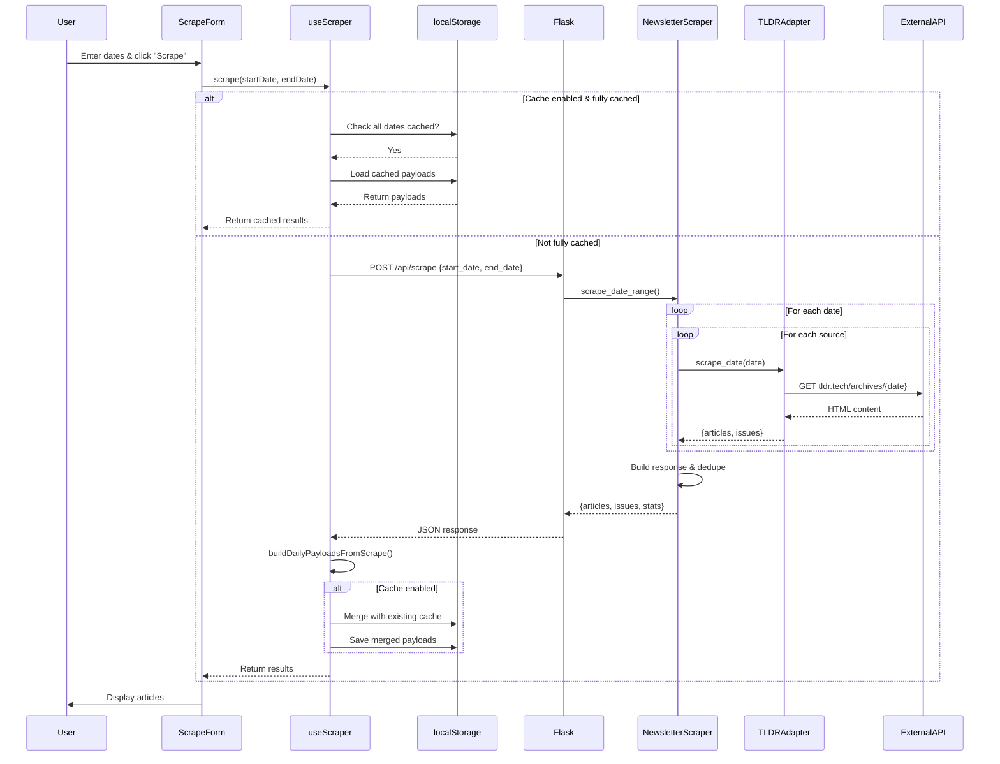
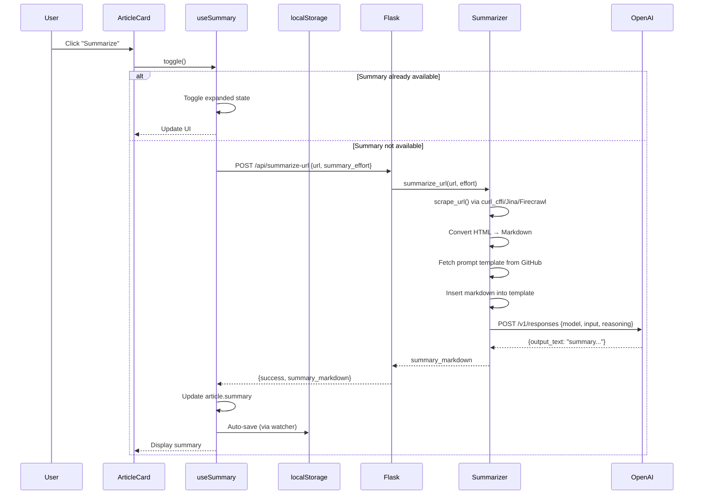

# TLDRScraper Architecture Documentation

## Overview

TLDRScraper is a newsletter aggregator that scrapes tech newsletters from multiple sources, displays them in a unified interface, and provides AI-powered summaries and TLDRs. The architecture follows a Vue 3 + Vite frontend communicating with a Flask backend via REST API.

## Technology Stack

**Frontend:**
- Vue 3 (Composition API)
- Vite (build tool)
- Marked.js (markdown parsing)
- DOMPurify (XSS sanitization)

**Backend:**
- Flask (Python web framework)
- curl_cffi (web scraping)
- Jina Reader API (web scraping fallback)
- Firecrawl API (web scraping fallback, optional)
- MarkItDown (HTML → Markdown conversion)
- OpenAI GPT-5 (AI summaries/TLDRs)

## Architecture Diagram

```plaintext
┌─────────────────────────────────────────────────────────────────────────┐
│                             User Browser                                 │
│  ┌───────────────────────────────────────────────────────────────────┐  │
│  │                        Vue 3 Application                          │  │
│  │  ┌────────────┐  ┌──────────────┐  ┌──────────────────────────┐  │  │
│  │  │  App.vue   │  │ Components   │  │    Composables           │  │  │
│  │  │            │  │              │  │                          │  │  │
│  │  │  - Root    │  │ - ScrapeForm │  │ - useScraper             │  │  │
│  │  │  - Hydrate │  │ - CacheToggle│  │ - useSummary             │  │  │
│  │  │  - Results │  │ - Results    │  │ - useArticleState        │  │  │
│  │  │    Display │  │   Display    │  │ - useCacheSettings       │  │  │
│  │  │            │  │ - ArticleList│  │ - useLocalStorage        │  │  │
│  │  │            │  │ - ArticleCard│  │                          │  │  │
│  │  └────────────┘  └──────────────┘  └──────────────────────────┘  │  │
│  │                                                                     │  │
│  │  ┌──────────────────────────────────────────────────────────────┐ │  │
│  │  │              LocalStorage (Browser Cache)                    │ │  │
│  │  │  - newsletters:scrapes:{date} → DailyPayload                 │ │  │
│  │  │  - cache:enabled → boolean                                   │ │  │
│  │  └──────────────────────────────────────────────────────────────┘ │  │
│  └───────────────────────────────────────────────────────────────────┘  │
└─────────────────────────────────────────────────────────────────────────┘
                                    │
                                    │ HTTP REST API
                                    ▼
┌─────────────────────────────────────────────────────────────────────────┐
│                          Flask Backend (Python)                          │
│  ┌───────────────────────────────────────────────────────────────────┐  │
│  │                         serve.py (Routes)                         │  │
│  │  POST /api/scrape          │  POST /api/summarize-url             │  │
│  │  POST /api/tldr-url        │  GET  /api/prompt                    │  │
│  └───────────────────────────────────────────────────────────────────┘  │
│                                    │                                     │
│                                    ▼                                     │
│  ┌───────────────────────────────────────────────────────────────────┐  │
│  │                       tldr_app.py (App Logic)                     │  │
│  │  - scrape_newsletters()    - summarize_url()                      │  │
│  │  - tldr_url()              - get_*_prompt_template()              │  │
│  └───────────────────────────────────────────────────────────────────┘  │
│                                    │                                     │
│                                    ▼                                     │
│  ┌───────────────────────────────────────────────────────────────────┐  │
│  │                    tldr_service.py (Service Layer)                │  │
│  │  - scrape_newsletters_in_date_range()                             │  │
│  │  - summarize_url_content()                                        │  │
│  │  - tldr_url_content()                                             │  │
│  └───────────────────────────────────────────────────────────────────┘  │
│              │                            │                              │
│              ▼                            ▼                              │
│  ┌────────────────────────┐   ┌──────────────────────────────────────┐ │
│  │  newsletter_scraper.py │   │       summarizer.py                  │ │
│  │                        │   │                                      │ │
│  │  - scrape_date_range() │   │  - summarize_url()                  │ │
│  │  - Adapter Factory     │   │  - tldr_url()                       │ │
│  │                        │   │  - url_to_markdown()                │ │
│  │  Uses:                 │   │  - scrape_url()                     │ │
│  │  - TLDRAdapter         │   │  - _call_llm()                      │ │
│  │  - HackerNewsAdapter   │   │                                      │ │
│  └────────────────────────┘   └──────────────────────────────────────┘ │
└─────────────────────────────────────────────────────────────────────────┘
                                    │
                                    ▼
┌─────────────────────────────────────────────────────────────────────────┐
│                          External Services                               │
│  ┌──────────────┐  ┌──────────────┐  ┌────────────────────────────┐   │
│  │  TLDR News   │  │ HackerNews   │  │  OpenAI GPT-5 API          │   │
│  │  Newsletter  │  │  API         │  │  (Summaries & TLDRs)       │   │
│  │  Archives    │  │              │  │                            │   │
│  └──────────────┘  └──────────────┘  └────────────────────────────┘   │
│  ┌──────────────┐  ┌──────────────┐  ┌────────────────────────────┐   │
│  │  Jina Reader │  │  curl_cffi   │  │  Firecrawl API             │   │
│  │  r.jina.ai   │  │  (Chrome)    │  │  api.firecrawl.dev         │   │
│  └──────────────┘  └──────────────┘  └────────────────────────────┘   │
└─────────────────────────────────────────────────────────────────────────┘
```

---

## Features & User Interactions

### 1. Newsletter Scraping
**User Action:** Enter start/end dates → Click "Scrape Newsletters"

**Available Interactions:**
- Select date range (max 31 days)
- Submit scrape request
- View progress bar
- View results grouped by date/issue

### 2. Cache Management
**User Action:** Toggle cache checkbox

**Available Interactions:**
- Enable/disable cache
- State persists in localStorage

### 3. Article State Management
**User Action:** Click article link / Remove button / Restore button

**Available Interactions:**
- Click article title → Mark as read + expand summary
- Click "Remove" → Mark as removed (visual strikethrough)
- Click "Restore" → Restore removed article
- Removed articles persist in localStorage

### 4. Summary Generation
**User Action:** Click "Summarize" button on article

**Available Interactions:**
- Click "Summarize" → Fetch summary from API
- Summary displayed inline below article
- Click again → Collapse summary
- Copy summary to clipboard
- Cached summaries show "Available" (green)

### 5. TLDR Generation
**User Action:** Click "TLDR" button on article

**Available Interactions:**
- Click "TLDR" → Fetch TLDR from API
- TLDR displayed inline below article
- Click again → Collapse TLDR (marks as tldrHidden; deprioritized)
- Cached TLDRs show "Available" (green)

### 6. Results Display
**User Action:** View scraped results

**Available Interactions:**
- Articles grouped by: Date → Issue/Category → Section
- Articles sorted by state: Unread → Read → TLDR-hidden → Removed
- Visual state indicators (bold = unread, muted = read, strikethrough = removed)
- Stats display (article count, unique URLs, dates processed)
- Collapsible debug logs

---

## State Machines

### Feature 1: Newsletter Scraping

#### States
1. **idle** - No scraping in progress
2. **validating** - Validating date range input
3. **checking_cache** - Checking if range is fully cached
4. **fetching_api** - Calling backend API
5. **merging_cache** - Merging API results with localStorage
6. **complete** - Results displayed
7. **error** - Error occurred

#### State Transitions

```
idle
  │
  ├─ User enters dates
  │    ↓
  │  validating
  │    │
  │    ├─ Valid dates
  │    │    ↓
  │    │  checking_cache
  │    │    │
  │    │    ├─ Fully cached & cache enabled
  │    │    │    ↓
  │    │    │  complete (load from cache)
  │    │    │
  │    │    └─ Not fully cached OR cache disabled
  │    │         ↓
  │    │       fetching_api
  │    │         │
  │    │         ├─ Success
  │    │         │    ↓
  │    │         │  merging_cache (if cache enabled)
  │    │         │    ↓
  │    │         │  complete
  │    │         │
  │    │         └─ Failure
  │    │              ↓
  │    │            error
  │    │
  │    └─ Invalid dates
  │         ↓
  │       error (validation error)
  │
  └─ (loop back to idle on next interaction)
```

#### Key State Data
- **startDate**: string (ISO date)
- **endDate**: string (ISO date)
- **loading**: boolean
- **progress**: number (0-100)
- **error**: string | null
- **results**: ResultsPayload | null

---

### Feature 2: Cache Management

#### States
1. **enabled** - Cache is active
2. **disabled** - Cache is inactive

#### State Transitions

```
enabled
  │
  ├─ User toggles OFF
  │    ↓
  │  disabled
  │    │
  │    └─ localStorage['cache:enabled'] = false
  │
  └─ User toggles ON
       ↓
     enabled
       │
       └─ localStorage['cache:enabled'] = true
```

#### Key State Data
- **enabled**: boolean (reactive, synced to localStorage)
- **statusText**: computed string ("(enabled)" | "(disabled)")

---

### Feature 3: Article State Management

#### States (per article)
1. **unread** - Default state, bold text
2. **read** - User clicked/viewed, muted text
3. **removed** - User removed, strikethrough + dashed border

#### State Transitions

```
unread
  │
  ├─ User clicks article link
  │    ↓
  │  read
  │    │
  │    ├─ article.read = { isRead: true, markedAt: timestamp }
  │    │
  │    └─ localStorage updated
  │
  ├─ User clicks "Remove"
  │    ↓
  │  removed
  │    │
  │    ├─ article.removed = true
  │    │
  │    └─ localStorage updated
  │
read
  │
  └─ User clicks "Remove"
       ↓
     removed
       │
       ├─ article.removed = true
       │
       └─ localStorage updated

removed
  │
  └─ User clicks "Restore"
       ↓
     unread (or previous state)
       │
       ├─ article.removed = false
       │
       └─ localStorage updated
```

#### Key State Data (per article)
- **url**: string (unique identifier)
- **issueDate**: string (storage key component)
- **read**: { isRead: boolean, markedAt: string | null }
- **removed**: boolean

---

### Feature 4: Summary Generation

#### States (per article summary)
1. **unknown** - Summary not yet requested
2. **creating** - API request in progress
3. **available** - Summary cached and ready
4. **error** - API request failed

#### State Transitions

```
unknown
  │
  └─ User clicks "Summarize"
       ↓
     creating
       │
       ├─ POST /api/summarize-url { url, summary_effort }
       │
       ├─ Success
       │    ↓
       │  available
       │    │
       │    ├─ summary.status = 'available'
       │    ├─ summary.markdown = response.summary_markdown
       │    ├─ summary.expanded = true
       │    │
       │    └─ localStorage updated
       │
       └─ Failure
            ↓
          error
            │
            ├─ summary.status = 'error'
            ├─ summary.errorMessage = error text
            │
            └─ localStorage updated

available
  │
  ├─ User clicks "Available"
  │    ↓
  │  (toggle expanded state, no API call)
  │
  └─ User clicks "Copy"
       ↓
     (copy to clipboard, no state change)
```

#### Key State Data (per article)
- **summary.status**: 'unknown' | 'creating' | 'available' | 'error'
- **summary.markdown**: string
- **summary.html**: computed (marked + DOMPurify)
- **summary.effort**: 'minimal' | 'low' | 'medium' | 'high'
- **summary.expanded**: boolean (UI state)
- **summary.errorMessage**: string | null

---

### Feature 5: TLDR Generation

#### States (per article TLDR)
1. **unknown** - TLDR not yet requested
2. **creating** - API request in progress
3. **available** - TLDR cached and ready
4. **error** - API request failed

#### State Transitions

```
unknown
  │
  └─ User clicks "TLDR"
       ↓
     creating
       │
       ├─ POST /api/tldr-url { url, summary_effort }
       │
       ├─ Success
       │    ↓
       │  available
       │    │
       │    ├─ tldr.status = 'available'
       │    ├─ tldr.markdown = response.tldr_markdown
       │    ├─ tldr.expanded = true
       │    ├─ Mark article as read
       │    │
       │    └─ localStorage updated
       │
       └─ Failure
            ↓
          error
            │
            ├─ tldr.status = 'error'
            ├─ tldr.errorMessage = error text
            │
            └─ localStorage updated

available
  │
  └─ User clicks "Available"
       ↓
     (toggle expanded state, no API call)
```

#### Key State Data (per article)
- **tldr.status**: 'unknown' | 'creating' | 'available' | 'error'
- **tldr.markdown**: string
- **tldr.html**: computed (marked + DOMPurify)
- **tldr.effort**: 'minimal' | 'low' | 'medium' | 'high'
- **tldr.expanded**: boolean (UI state)
- **tldr.errorMessage**: string | null

---

## Call Graphs

### Feature 1: Newsletter Scraping - Complete Flow

#### Client → Backend → External Services

```
User clicks "Scrape Newsletters"
  │
  ├─ ScrapeForm.vue:51 handleSubmit()
  │    │
  │    ├─ Check validationError (computed)
  │    │    │
  │    │    └─ If invalid: return early
  │    │
  │    └─ Call useScraper.scrape(startDate, endDate)
  │
  └─ useScraper.js:144 scrape(startDate, endDate)
       │
       ├─ Reset state:
       │    - loading.value = true
       │    - progress.value = 0
       │    - error.value = null
       │
       ├─ Step 1: Check cache
       │    │
       │    └─ useScraper.js:43 isRangeCached(startDate, endDate)
       │         │
       │         ├─ Compute date range: computeDateRange()
       │         │    │
       │         │    └─ Returns: ['2024-01-03', '2024-01-02', '2024-01-01']
       │         │
       │         └─ Check each date in localStorage:
       │              │
       │              └─ localStorage.getItem('newsletters:scrapes:2024-01-01')
       │                   │
       │                   ├─ If ALL dates cached AND cacheEnabled = true
       │                   │    │
       │                   │    └─ useScraper.js:56 loadFromCache()
       │                   │         │
       │                   │         ├─ Parse each cached payload
       │                   │         ├─ Build stats: buildStatsFromPayloads()
       │                   │         ├─ progress.value = 100
       │                   │         │
       │                   │         └─ Return cached results
       │                   │
       │                   └─ If NOT fully cached OR cache disabled
       │                        │
       │                        └─ Continue to API call...
       │
       ├─ Step 2: API Call
       │    │
       │    ├─ progress.value = 50
       │    ├─ Collect excluded URLs from localStorage (removed + read articles)
       │    │
       │    └─ window.fetch('/api/scrape', {
       │         method: 'POST',
       │         body: JSON.stringify({ start_date, end_date, excluded_urls })
       │       })
       │         │
       │         └─ Server receives request...
       │              │
       │              ├─ serve.py:36 scrape_newsletters_in_date_range()
       │              │    │
       │              │    ├─ Extract request.get_json()
       │              │    │    - start_date: "2024-01-01"
       │              │    │    - end_date: "2024-01-03"
       │              │    │    - sources: null (optional)
       │              │    │    - excluded_urls: ["https://example.com/...", ...]
       │              │    │
       │              │    └─ tldr_app.py:9 scrape_newsletters(start_date, end_date, source_ids, excluded_urls)
       │              │         │
       │              │         └─ tldr_service.py:45 scrape_newsletters_in_date_range()
       │              │              │
       │              │              ├─ tldr_service.py:19 _parse_date_range()
       │              │              │    │
       │              │              │    ├─ Parse ISO dates
       │              │              │    ├─ Validate: start <= end
       │              │              │    ├─ Validate: range < 31 days
       │              │              │    │
       │              │              │    └─ Return (datetime, datetime)
       │              │              │
       │              │              └─ newsletter_scraper.py:205 scrape_date_range(start_date, end_date, source_ids, excluded_urls)
       │              │                   │
       │              │                   ├─ util.get_date_range(start, end)
       │              │                   │    │
       │              │                   │    └─ Returns list of dates: [date1, date2, date3]
       │              │                   │
       │              │                   ├─ Default sources: NEWSLETTER_CONFIGS.keys()
       │              │                   │    - ['tldr_tech', 'tldr_ai', 'hackernews', ...]
       │              │                   │
       │              │                   ├─ Initialize tracking:
       │              │                   │    - all_articles = []
       │              │                   │    - url_set = set()
       │              │                   │    - issue_metadata_by_key = {}
       │              │                   │
       │              │                   └─ For each date in dates:
       │              │                        │
       │              │                        └─ For each source_id in source_ids:
       │              │                             │
       │              │                             ├─ newsletter_scraper.py:128 _collect_newsletters_for_date_from_source()
       │              │                             │    │
       │              │                             │    ├─ newsletter_scraper.py:16 _get_adapter_for_source(config)
       │              │                             │    │    │
       │              │                             │    │    ├─ If source_id.startswith('tldr_'):
       │              │                             │    │    │    │
       │              │                             │    │    │    └─ Return TLDRAdapter(config)
       │              │                             │    │    │
       │              │                             │    │    └─ If source_id == 'hackernews':
       │              │                             │    │         │
       │              │                             │    │         └─ Return HackerNewsAdapter(config)
       │              │                             │    │
       │              │                             │    └─ adapter.scrape_date(date, excluded_urls)
       │              │                             │         │
       │              │                             │         ├─ TLDRAdapter: Scrapes tldr.tech archives
       │              │                             │         │    │
       │              │                             │         │    ├─ Build URL: f"https://tldr.tech/{newsletter_type}/archives/{date}"
       │              │                             │         │    ├─ HTTP GET request
       │              │                             │         │    ├─ Parse HTML for articles
       │              │                             │         │    ├─ Filter out excluded URLs
       │              │                             │         │    │
       │              │                             │         │    └─ Return { articles: [...], issues: [...] }
       │              │                             │         │
       │              │                             │         └─ HackerNewsAdapter: Scrapes HN API (Algolia)
       │              │                             │              │
       │              │                             │              ├─ Fetch 50 stories from Algolia (pre-filtered by date/score)
       │              │                             │              ├─ Filter out excluded URLs (canonical matching)
       │              │                             │              ├─ Calculate leading scores: (2 × upvotes) + comments
       │              │                             │              ├─ Sort by leading score descending
       │              │                             │              ├─ Convert top stories to articles
       │              │                             │              │
       │              │                             │              └─ Return { articles: [...], issues: [] }
       │              │                             │
       │              │                             ├─ For each article in result:
       │              │                             │    │
       │              │                             │    ├─ Canonicalize URL
       │              │                             │    ├─ Deduplicate via url_set
       │              │                             │    │
       │              │                             │    └─ Append to all_articles
       │              │                             │
       │              │                             └─ Sleep 0.2s (rate limiting)
       │              │
       │              ├─ newsletter_scraper.py:37 _build_scrape_response()
       │              │    │
       │              │    ├─ Group articles by date
       │              │    ├─ Build markdown output (newsletter_merger.py)
       │              │    ├─ Build issues list
       │              │    ├─ Compute stats
       │              │    │
       │              │    └─ Return {
       │              │         success: true,
       │              │         articles: [...],
       │              │         issues: [...],
       │              │         stats: { total_articles, unique_urls, ... }
       │              │       }
       │              │
       │              └─ Flask jsonify() → HTTP Response
       │
       ├─ Step 3: Process Response
       │    │
       │    └─ useScraper.js:176 buildDailyPayloadsFromScrape(data)
       │         │
       │         ├─ Group articles by date
       │         ├─ Group issues by date
       │         │
       │         └─ Build daily payloads: [{
       │              date: "2024-01-01",
       │              articles: [...],
       │              issues: [...],
       │              cachedAt: timestamp
       │            }]
       │
       ├─ Step 4: Merge with Cache (if enabled)
       │    │
       │    └─ useScraper.js:108 mergeWithCache(payloads)
       │         │
       │         └─ For each payload:
       │              │
       │              ├─ useLocalStorage('newsletters:scrapes:${date}')
       │              │    │
       │              │    ├─ If cached data exists:
       │              │    │    │
       │              │    │    └─ Merge articles (preserve summary, tldr, read, removed)
       │              │    │
       │              │    └─ Save merged payload to localStorage
       │              │
       │              └─ Return merged payload
       │
       ├─ Step 5: Update State
       │    │
       │    ├─ progress.value = 100
       │    ├─ results.value = { success, payloads, source, stats }
       │    │
       │    └─ Return results
       │
       └─ Step 6: Display Results
            │
            └─ ScrapeForm.vue:56 emit('results', results)
                 │
                 └─ App.vue:27 handleResults(data)
                      │
                      ├─ results.value = data
                      │
                      └─ ResultsDisplay.vue renders:
                           │
                           ├─ Stats
                           ├─ Debug logs
                           │
                           └─ ArticleList (grouped by date/issue)
                                │
                                └─ ArticleCard (for each article)
```

---

### Feature 4: Summary Generation - Complete Flow

```
User clicks "Summarize" button
  │
  ├─ ArticleCard.vue:126 @click="summary.toggle()"
  │    │
  │    └─ useSummary.js:109 toggle(summaryEffort)
  │         │
  │         ├─ Check if summary already available:
  │         │    │
  │         │    ├─ If isAvailable = true:
  │         │    │    │
  │         │    │    └─ expanded.value = !expanded.value (no API call)
  │         │    │
  │         │    └─ If isAvailable = false:
  │         │         │
  │         │         └─ useSummary.js:55 fetch(summaryEffort)
  │         │
  │         └─ fetch() flow:
  │              │
  │              ├─ loading.value = true
  │              ├─ article.value.summary.status = 'creating'
  │              │
  │              └─ window.fetch('/api/summarize-url', {
  │                   method: 'POST',
  │                   body: JSON.stringify({ url, summary_effort })
  │                 })
  │                   │
  │                   └─ Server receives request...
  │                        │
  │                        ├─ serve.py:92 summarize_url()
  │                        │    │
  │                        │    ├─ Extract request.get_json()
  │                        │    │    - url: "https://example.com/article"
  │                        │    │    - summary_effort: "low"
  │                        │    │
  │                        │    └─ tldr_app.py:35 summarize_url(url, summary_effort)
  │                        │         │
  │                        │         └─ tldr_service.py:83 summarize_url_content(url, summary_effort)
  │                        │              │
  │                        │              ├─ util.canonicalize_url(url)
  │                        │              │    │
  │                        │              │    └─ Returns canonical URL
  │                        │              │
  │                        │              └─ summarizer.py:231 summarize_url(canonical_url, summary_effort)
  │                        │                   │
  │                        │                   ├─ summarizer.py:215 url_to_markdown(url)
  │                        │                   │    │
  │                        │                   │    ├─ Check if GitHub repo URL:
  │                        │                   │    │    │
  │                        │                   │    │    ├─ If yes: _fetch_github_readme(url)
  │                        │                   │    │    │    │
  │                        │                   │    │    │    ├─ Try: raw.githubusercontent.com/.../README.md
  │                        │                   │    │    │    └─ Return markdown content
  │                        │                   │    │    │
  │                        │                   │    │    └─ If no: scrape_url(url)
  │                        │                   │    │
  │                        │                   │    └─ summarizer.py:100 scrape_url(url)
  │                        │                   │         │
  │                        │                   │         ├─ Try Method 1: curl_cffi (timeout: 10s)
  │                        │                   │         │    │
  │                        │                   │         │    ├─ curl_requests.get(url, impersonate="chrome131")
  │                        │                   │         │    │
  │                        │                   │         │    └─ If success: return response
  │                        │                   │         │
  │                        │                   │         ├─ Try Method 2: Jina Reader (timeout: 10s)
  │                        │                   │         │    │
  │                        │                   │         │    ├─ Build Jina URL: "https://r.jina.ai/http://..."
  │                        │                   │         │    ├─ requests.get(jina_url)
  │                        │                   │         │    │
  │                        │                   │         │    └─ If success: return response
  │                        │                   │         │
  │                        │                   │         └─ Try Method 3: Firecrawl (timeout: 60s, if API key configured)
  │                        │                   │              │
  │                        │                   │              ├─ POST api.firecrawl.dev/v1/scrape
  │                        │                   │              ├─ Requires FIRECRAWL_API_KEY
  │                        │                   │              │
  │                        │                   │              └─ If success: return mock response with HTML
  │                        │                   │
  │                        │                   ├─ Convert response to markdown:
  │                        │                   │    │
  │                        │                   │    └─ MarkItDown.convert_response(response)
  │                        │                   │         │
  │                        │                   │         └─ Returns markdown string
  │                        │                   │
  │                        │                   ├─ Fetch prompt template:
  │                        │                   │    │
  │                        │                   │    └─ summarizer.py:324 _fetch_summarize_prompt()
  │                        │                   │         │
  │                        │                   │         ├─ Check cache: globals()['_PROMPT_CACHE']
  │                        │                   │         │    │
  │                        │                   │         │    └─ If cached: return cached prompt
  │                        │                   │         │
  │                        │                   │         └─ If not cached:
  │                        │                   │              │
  │                        │                   │              ├─ Fetch from GitHub:
  │                        │                   │              │    "https://api.github.com/repos/giladbarnea/llm-templates/contents/text/summarize.md"
  │                        │                   │              │
  │                        │                   │              └─ Cache and return
  │                        │                   │
  │                        │                   ├─ Insert markdown into prompt:
  │                        │                   │    │
  │                        │                   │    └─ _insert_markdown_into_template(template, markdown)
  │                        │                   │         │
  │                        │                   │         └─ Inject between <summarize this> tags
  │                        │                   │
  │                        │                   └─ Call LLM:
  │                        │                        │
  │                        │                        └─ summarizer.py:377 _call_llm(prompt, summary_effort)
  │                        │                             │
  │                        │                             ├─ Build OpenAI request:
  │                        │                             │    {
  │                        │                             │      model: "gpt-5",
  │                        │                             │      input: prompt,
  │                        │                             │      reasoning: { effort: "low" }
  │                        │                             │    }
  │                        │                             │
  │                        │                             ├─ POST https://api.openai.com/v1/responses
  │                        │                             │
  │                        │                             ├─ Parse response:
  │                        │                             │    - Extract output_text or content
  │                        │                             │
  │                        │                             └─ Return summary markdown
  │                        │
  │                        ├─ Build response payload:
  │                        │    {
  │                        │      success: true,
  │                        │      summary_markdown: "...",
  │                        │      canonical_url: "...",
  │                        │      summary_effort: "low"
  │                        │    }
  │                        │
  │                        └─ Flask jsonify() → HTTP Response
  │
  └─ Client receives response:
       │
       ├─ useSummary.js:79 response.json()
       │    │
       │    └─ If result.success:
       │         │
       │         ├─ Update article.value.summary:
       │         │    {
       │         │      status: 'available',
       │         │      markdown: result.summary_markdown,
       │         │      effort: summaryEffort,
       │         │      checkedAt: new Date().toISOString(),
       │         │      errorMessage: null
       │         │    }
       │         │
       │         ├─ expanded.value = true
       │         │
       │         └─ localStorage auto-updates (via useLocalStorage watcher)
       │
       └─ ArticleCard.vue renders:
            │
            └─ v-if="summary.expanded.value && summary.html.value"
                 │
                 ├─ Compute summary.html (marked + DOMPurify)
                 │
                 └─ Display inline summary
```

---

### Feature 5: TLDR Generation - Complete Flow

```
User clicks "TLDR" button
  │
  ├─ ArticleCard.vue:151 @click="handleTldrClick()"
  │    │
  │    └─ ArticleCard.vue:75 tldr.toggle()
  │         │
  │         └─ useSummary.js:109 toggle() [type='tldr']
  │              │
  │              ├─ Check if TLDR already available
  │              │
  │              └─ useSummary.js:55 fetch(summaryEffort)
  │                   │
  │                   └─ window.fetch('/api/tldr-url', {
  │                        method: 'POST',
  │                        body: JSON.stringify({ url, summary_effort })
  │                      })
  │                        │
  │                        └─ Server receives request...
  │                             │
  │                             ├─ serve.py:130 tldr_url()
  │                             │    │
  │                             │    └─ tldr_app.py:61 tldr_url(url, summary_effort)
  │                             │         │
  │                             │         └─ tldr_service.py:117 tldr_url_content(url, summary_effort)
  │                             │              │
  │                             │              ├─ util.canonicalize_url(url)
  │                             │              │
  │                             │              └─ summarizer.py:251 tldr_url(url, summary_effort)
  │                             │                   │
  │                             │                   ├─ url_to_markdown(url)
  │                             │                   │    [Same flow as summarize]
  │                             │                   │
  │                             │                   ├─ Fetch TLDR prompt template:
  │                             │                   │    │
  │                             │                   │    └─ _fetch_tldr_prompt()
  │                             │                   │         │
  │                             │                   │         └─ Fetch from GitHub:
  │                             │                   │              "https://api.github.com/repos/giladbarnea/llm-templates/contents/text/tldr.md"
  │                             │                   │
  │                             │                   ├─ Build prompt:
  │                             │                   │    template + "\n\n<tldr this>\n" + markdown + "\n</tldr this>"
  │                             │                   │
  │                             │                   └─ Call LLM:
  │                             │                        │
  │                             │                        └─ _call_llm(prompt, summary_effort)
  │                             │                             [Same flow as summarize]
  │                             │
  │                             └─ Return { success, tldr_markdown, canonical_url, summary_effort }
  │
  └─ Client receives response:
       │
       ├─ Update article.value.tldr:
       │    {
       │      status: 'available',
       │      markdown: result.tldr_markdown,
       │      effort: summaryEffort,
       │      checkedAt: timestamp,
       │      errorMessage: null
       │    }
       │
       ├─ expanded.value = true
       ├─ Mark article as read (if not already)
       │
       └─ Display inline TLDR
```

---

## Data Structures

### DailyPayload (localStorage: `newsletters:scrapes:{date}`)

```typescript
{
  date: string,              // "2024-01-01"
  cachedAt: string,          // ISO timestamp
  articles: Article[],       // Array of articles for this date
  issues: Issue[]            // Array of newsletter issues for this date
}
```

### Article

```typescript
{
  url: string,               // Canonical URL (unique identifier)
  title: string,
  issueDate: string,         // "2024-01-01"
  category: string,          // "TLDR Tech", "HackerNews", etc.
  sourceId: string,          // "tldr_tech", "hackernews"
  section: string | null,    // Section title within newsletter
  sectionEmoji: string | null,
  sectionOrder: number | null,
  newsletterType: string | null,

  // User state
  removed: boolean,
  tldrHidden: boolean,
  read: {
    isRead: boolean,
    markedAt: string | null  // ISO timestamp
  },

  // AI-generated content
  summary: {
    status: 'unknown' | 'creating' | 'available' | 'error',
    markdown: string,
    effort: 'minimal' | 'low' | 'medium' | 'high',
    checkedAt: string | null,
    errorMessage: string | null
  },

  tldr: {
    status: 'unknown' | 'creating' | 'available' | 'error',
    markdown: string,
    effort: 'minimal' | 'low' | 'medium' | 'high',
    checkedAt: string | null,
    errorMessage: string | null
  }
}
```

### Issue

```typescript
{
  date: string,              // "2024-01-01"
  source_id: string,         // "tldr_tech"
  category: string,          // "TLDR Tech"
  title: string | null,      // Issue title
  subtitle: string | null    // Issue subtitle
}
```

### ScrapeRequest (POST /api/scrape)

```typescript
{
  start_date: string,        // "2024-01-01"
  end_date: string,          // "2024-01-03"
  sources?: string[],        // ["tldr_tech", "hackernews"] (optional)
  excluded_urls: string[]    // Canonical URLs to exclude (removed + read articles)
}
```

### ScrapeResponse (API response)

```typescript
{
  success: boolean,
  articles: Article[],       // All articles (flattened)
  issues: Issue[],           // All issues
  stats: {
    total_articles: number,
    unique_urls: number,
    dates_processed: number,
    dates_with_content: number,
    network_fetches: number,
    cache_mode: string,
    debug_logs: string[]
  },
  output: string             // Markdown formatted output
}
```

---

## Component Dependency Graph

```
App.vue
  │
  ├── CacheToggle.vue
  │     └── useCacheSettings()
  │           └── useLocalStorage('cache:enabled')
  │
  ├── ScrapeForm.vue
  │     └── useScraper()
  │           ├── useLocalStorage('newsletters:scrapes:{date}')
  │           └── useCacheSettings()
  │
  └── ResultsDisplay.vue
        │
        └── ArticleList.vue
              │
              └── ArticleCard.vue
                    ├── useArticleState(date, url)
                    │     └── useLocalStorage('newsletters:scrapes:{date}')
                    │
                    ├── useSummary(date, url, 'summary')
                    │     └── useArticleState(date, url)
                    │
                    └── useSummary(date, url, 'tldr')
                          └── useArticleState(date, url)
```

---

## Sequence Diagram: Full Scraping Flow



---

## Sequence Diagram: Summary Generation Flow



---

## Key Algorithms

### 1. Article Sorting Algorithm (ArticleList.vue:22)

```javascript
// Sort articles by state (unread → read → tldrHidden → removed), then by original order
function sortArticles(articles) {
  return articles.sort((a, b) => {
    const stateA = getArticleState(a)  // 0=unread, 1=read, 2=tldrHidden, 3=removed
    const stateB = getArticleState(b)

    // Primary sort: by state
    if (stateA !== stateB) return stateA - stateB

    // Secondary sort: preserve original order within same state
    return (a.originalOrder ?? 0) - (b.originalOrder ?? 0)
  })
}
```

### 2. Date Range Computation (useScraper.js:20)

```javascript
// Compute all dates between start and end (inclusive, descending)
function computeDateRange(startDate, endDate) {
  const dates = []
  const start = new Date(startDate)
  const end = new Date(endDate)

  const current = new Date(end)
  while (current >= start) {
    dates.push(current.toISOString().split('T')[0])
    current.setDate(current.getDate() - 1)
  }

  return dates  // ['2024-01-03', '2024-01-02', '2024-01-01']
}
```

### 3. Cache Merge Algorithm (useScraper.js:108)

```javascript
// Merge new scrape results with existing cached data
function mergeWithCache(payloads) {
  return payloads.map(payload => {
    const cached = localStorage.getItem(`newsletters:scrapes:${payload.date}`)

    if (cached) {
      // Merge: preserve user state (read, removed, tldrHidden) and AI content (summary, tldr)
      return {
        ...payload,
        articles: payload.articles.map(article => {
          const existing = cached.articles.find(a => a.url === article.url)
          return existing
            ? { ...article, summary: existing.summary, tldr: existing.tldr,
                read: existing.read, removed: existing.removed, tldrHidden: existing.tldrHidden }
            : article
        })
      }
    }

    return payload
  })
}
```

### 4. URL Deduplication (newsletter_scraper.py:172)

```python
# Deduplicate articles across sources using canonical URLs
url_set = set()
all_articles = []

for article in scraped_articles:
    canonical_url = util.canonicalize_url(article['url'])
    article['url'] = canonical_url

    if canonical_url not in url_set:
        url_set.add(canonical_url)
        all_articles.append(article)
```

---

## LocalStorage Schema

### Key Patterns

```
cache:enabled → boolean

newsletters:scrapes:{date} → DailyPayload
  Example: newsletters:scrapes:2024-01-01 → {
    date: "2024-01-01",
    cachedAt: "2024-01-01T12:00:00Z",
    articles: [...],
    issues: [...]
  }
```

### Storage Flow

1. **Initial Scrape**: API response → Build payloads → Save to localStorage
2. **Cache Hit**: Read from localStorage → Skip API call
3. **User Interaction**: Modify article state → localStorage auto-updates (via Vue watcher) and dispatches 'local-storage-change' (same-tab reactivity)
4. **Summary/TLDR**: Fetch from API → Update article → localStorage auto-updates

---

## Error Handling

### Frontend Errors

1. **Validation Errors**
   - Date range > 31 days → Show inline error
   - Start date > end date → Show inline error

2. **Network Errors**
   - API unreachable → Show error message
   - Timeout → Show error message

3. **Summary/TLDR Errors**
   - Scraping failed → summary.status = 'error'
   - LLM API failed → summary.errorMessage = "..."
   - Button shows "Retry" instead of "Available"

### Backend Errors

1. **Scraping Errors**
   - Individual source failures → Log warning, continue with other sources
   - All sources fail → Return partial results

2. **Summary/TLDR Errors**
   - Try multiple scraping methods (curl_cffi → Jina Reader → Firecrawl)
   - Return 502 on network errors
   - Return 500 on LLM errors

---

## Performance Considerations

1. **Caching Strategy**
   - Cache at daily granularity (not per-source)
   - Merge strategy preserves user state and AI content
   - Cache check before every API call

2. **Rate Limiting**
   - 0.2s delay between source scrapes
   - Prevents overwhelming external APIs

3. **Lazy Loading**
   - Summaries/TLDRs fetched on-demand
   - Not included in initial scrape
   - Cached after first fetch

4. **Component Optimization**
   - Scoped CSS prevents style leakage
   - Computed properties cache derived state
   - v-if for conditional rendering (unmounts DOM)

---

## Security Measures

1. **XSS Prevention**
   - DOMPurify sanitizes all markdown → HTML conversions
   - v-html only used with sanitized content

2. **CSRF Protection**
   - Same-origin policy (frontend served from same domain)

3. **Input Validation**
   - Date range validation (client + server)
   - URL canonicalization (prevents cache poisoning)

4. **API Key Management**
   - OpenAI API key server-side only
   - GitHub token for private repos (optional)
   - Firecrawl API key for hard-to-scrape sites (optional)

---

## Testing Considerations

### Unit Tests (Frontend)

- `useScraper.js`: Date range computation, cache hit/miss logic
- `useArticleState.js`: State mutations (read/unread/removed)
- `useSummary.js`: Toggle expansion, fetch logic

### Integration Tests

- Full scraping flow (API → cache → display)
- Summary generation end-to-end
- Cache merge behavior

### E2E Tests

- User scrapes date range → Views results
- User marks article as read → State persists
- User generates summary → Summary displays and caches

---

## Future Enhancements

1. **Reasoning Effort Selector**
   - Dropdown on summary button (minimal/low/medium/high)
   - Currently hardcoded to "low"

2. **Source Filtering**
   - UI to select which newsletters to scrape
   - Backend already supports `sources` parameter

3. **Export Functionality**
   - Export articles as markdown/JSON
   - Bulk copy summaries

4. **Search & Filter**
   - Full-text search across articles
   - Filter by category/source/state

---

## File Structure

```
TLDRScraper/
├── client/                    # Vue 3 frontend
│   ├── src/
│   │   ├── App.vue           # Root component
│   │   ├── main.js           # Entry point
│   │   ├── components/       # UI components
│   │   │   ├── ArticleCard.vue
│   │   │   ├── ArticleList.vue
│   │   │   ├── CacheToggle.vue
│   │   │   ├── ResultsDisplay.vue
│   │   │   └── ScrapeForm.vue
│   │   └── composables/      # Reusable logic
│   │       ├── useArticleState.js
│   │       ├── useCacheSettings.js
│   │       ├── useLocalStorage.js
│   │       ├── useScraper.js
│   │       └── useSummary.js
│   ├── index.html
│   ├── vite.config.js
│   └── package.json
│
├── api/                       # Backend entry point
│   └── index.py
│
├── serve.py                   # Flask routes
├── tldr_app.py               # Application logic layer
├── tldr_service.py           # Service layer
├── newsletter_scraper.py     # Scraping orchestration
├── summarizer.py             # URL → Summary/TLDR
├── newsletter_adapter.py     # Base adapter
├── tldr_adapter.py           # TLDR newsletter adapter
├── hackernews_adapter.py     # HackerNews adapter
├── newsletter_merger.py      # Markdown formatting
├── newsletter_config.py      # Source configurations
└── util.py                   # Shared utilities
```

---

## Conclusion

TLDRScraper is a full-stack newsletter aggregator with sophisticated client-side state management, intelligent caching, and AI-powered content summarization. The architecture separates concerns clearly:

- **Vue composables** handle reactive state and API calls
- **Flask routes** provide clean REST endpoints
- **Service/adapter layers** abstract data sources
- **localStorage** provides persistence without a database
- **OpenAI integration** enhances content with summaries

The system is designed for extensibility (new newsletter sources via adapters), performance (multi-level caching), and user experience (reactive UI with optimistic updates).
