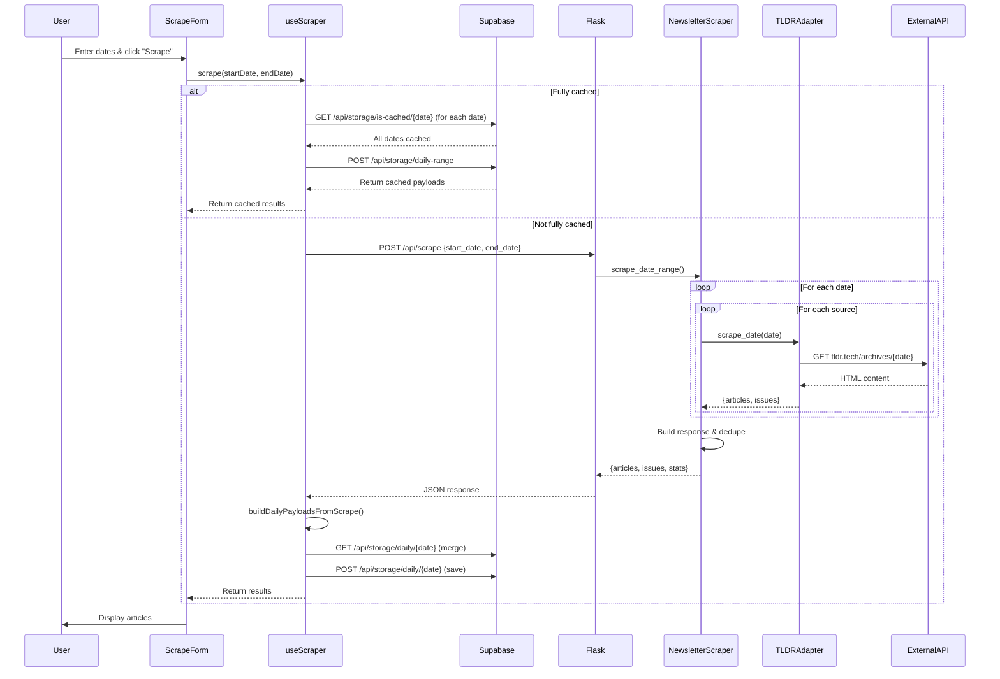

# TLDRScraper Architecture Documentation

## Overview

TLDRScraper is a newsletter aggregator that scrapes tech newsletters from multiple sources, displays them in a unified interface, and provides AI-powered summaries. The architecture follows a React 19 + Vite frontend communicating with a Flask backend via REST API, with all state and cache data persisted server-side in Supabase PostgreSQL.

## Technology Stack

**Frontend:**
- React 19
- Vite (build tool)
- Tailwind CSS v4 (utility-first CSS framework)
- Marked.js (markdown parsing)
- DOMPurify (XSS sanitization)

**Backend:**
- Flask (Python web framework)
- Supabase PostgreSQL (database for all state/cache persistence)
- curl_cffi (web scraping)
- Jina Reader API (web scraping fallback)
- Firecrawl API (web scraping fallback, optional)
- MarkItDown (HTML → Markdown conversion)
- Google Gemini 3 Pro (Generative Language API for summaries)

## Architecture Diagram

```plaintext
┌─────────────────────────────────────────────────────────────────────────┐
│                             User Browser                                 │
│  ┌───────────────────────────────────────────────────────────────────┐  │
│  │                       React 19 Application                        │  │
│  │  ┌────────────┐  ┌──────────────┐  ┌──────────────────────────┐  │  │
│  │  │  App.jsx   │  │ Components   │  │    Hooks                 │  │  │
│  │  │            │  │              │  │                          │  │  │
│  │  │  - Root    │  │ - ScrapeForm │  │ - useArticleState        │  │  │
│  │  │  - Hydrate │  │ - Results    │  │ - useSummary             │  │  │
│  │  │  - Results │  │   Display    │  │ - useSupabaseStorage     │  │  │
│  │  │    Display │  │ - Feed       │  │ - useDigest              │  │  │
│  │  │            │  │ - CalendarDay│  │                          │  │  │
│  │  │            │  │ - Newsletter │  │ Lib                      │  │  │
│  │  │            │  │   Day        │  │ - scraper.js             │  │  │
│  │  │            │  │ - ArticleList│  │ - storageApi.js          │  │  │
│  │  │            │  │ - ArticleCard│  │                          │  │  │
│  │  └────────────┘  └──────────────┘  └──────────────────────────┘  │  │
│  └───────────────────────────────────────────────────────────────────┘  │
└─────────────────────────────────────────────────────────────────────────┘
                                    │
                                    │ HTTP REST API
                                    ▼
┌─────────────────────────────────────────────────────────────────────────┐
│                          Flask Backend (Python)                          │
│  ┌───────────────────────────────────────────────────────────────────┐  │
│  │                         serve.py (Routes)                         │  │
│  │  POST /api/scrape             POST /api/summarize-url            │  │
│  │  GET/POST /api/storage/setting/<key>                             │  │
│  │  GET/POST /api/storage/daily/<date>                              │  │
│  │  POST /api/storage/daily-range                                   │  │
│  │  GET /api/storage/is-cached/<date>                               │  │
│  └───────────────────────────────────────────────────────────────────┘  │
│                                    │                                     │
│                                    ▼                                     │
│  ┌───────────────────────────────────────────────────────────────────┐  │
│  │                       tldr_app.py (App Logic)                     │  │
│  │  - scrape_newsletters()    - tldr_url()                           │  │
│  │  - get_tldr_prompt_template()                                    │  │
│  └───────────────────────────────────────────────────────────────────┘  │
│                                    │                                     │
│                                    ▼                                     │
│  ┌───────────────────────────────────────────────────────────────────┐  │
│  │                    tldr_service.py (Service Layer)                │  │
│  │  - scrape_newsletters_in_date_range()                             │  │
│  │  - tldr_url_content()                                             │  │
│  └───────────────────────────────────────────────────────────────────┘  │
│  ┌───────────────────────────────────────────────────────────────────┐  │
│  │                 storage_service.py (Storage Layer)                │  │
│  │  - get_setting() / set_setting()                                  │  │
│  │  - get_daily_payload() / set_daily_payload()                      │  │
│  │  - get_daily_payloads_range() / is_date_cached()                  │  │
│  └───────────────────────────────────────────────────────────────────┘  │
│              │                            │                              │
│              ▼                            ▼                              │
│  ┌────────────────────────┐   ┌──────────────────────────────────────┐ │
│  │  newsletter_scraper.py │   │       summarizer.py                  │ │
│  │                        │   │                                      │ │
│  │  - scrape_date_range() │   │  - tldr_url()                       │ │
│  │  - Adapter Factory     │   │  - url_to_markdown()                │ │
│  │                        │   │  - scrape_url()                     │ │
│  │  24 Adapter Classes:   │   │  - _call_llm()                      │ │
│  │  TLDR, HackerNews,     │   │                                      │ │
│  │  Anthropic, Stripe,    │   │                                      │ │
│  │  Simon Willison, etc.  │   │                                      │ │
│  └────────────────────────┘   └──────────────────────────────────────┘ │
└─────────────────────────────────────────────────────────────────────────┘
                                    │
                                    ▼
┌─────────────────────────────────────────────────────────────────────────┐
│                   Database & External Services                           │
│  ┌──────────────────────────────────────────────────────────────────┐  │
│  │  Supabase PostgreSQL Database                                    │  │
│  │  - settings table (key-value for UI preferences, etc.)           │  │
│  │  - daily_cache table (JSONB payloads by date)                    │  │
│  └──────────────────────────────────────────────────────────────────┘  │
│  ┌──────────────┐  ┌──────────────┐  ┌────────────────────────────┐   │
│  │  TLDR News   │  │ HackerNews   │  │  Google Gemini 3 Pro API   │   │
│  │  Newsletter  │  │  API         │  │  (summaries)               │   │
│  │  Archives    │  │              │  │                            │   │
│  └──────────────┘  └──────────────┘  └────────────────────────────┘   │
│  ┌──────────────┐  ┌──────────────┐  ┌────────────────────────────┐   │
│  │  Jina Reader │  │  curl_cffi   │  │  Firecrawl API             │   │
│  │  r.jina.ai   │  │  (Chrome)    │  │  api.firecrawl.dev         │   │
│  └──────────────┘  └──────────────┘  └────────────────────────────┘   │
└─────────────────────────────────────────────────────────────────────────┘
```

---

## Features & User Interactions

### 1. Newsletter Scraping
**User Action:** Enter start/end dates → Click "Scrape Newsletters"

**Available Interactions:**
- Select date range (max 31 days)
- Submit scrape request
- View progress bar
- View results grouped by date/issue

### 2. Persisted Article Workflow
**User Action:** Read, remove, restore, summarize, and revisit articles across sessions

**Available Interactions:**
- Article-level user state is stored server-side inside each day's payload
- Read/removed status persists across refreshes and devices
- Summary and digest results persist alongside the article payload they belong to

### 3. Reading Views and Summaries
**User Action:** Open an article summary or digest view

**Available Interactions:**
- Single-article summaries are generated on demand through the backend summary pipeline
- Digest summaries synthesize multiple selected articles into a shared reading surface
- Summary content is cached in the same daily payload as the source articles

### 4. Feed Presentation
**User Action:** View scraped results

**Available Interactions:**
- Feed is grouped by date, issue/category, and section
- Daily payloads synchronize through a shared storage layer backed by Supabase
- The presentation layer surfaces persisted article state and scrape metadata
- Stats display (article count, unique URLs, dates processed)
- Collapsible debug logs

### 5. Tailwind CSS v4 Configuration
**Configuration Method:** CSS-first via `@theme` directive in index.css

**Custom Design Tokens:**
- Font stacks: `--font-sans` (SF Pro Text), `--font-display` (SF Pro Display)
- Brand colors: Sky blue palette (brand-50 through brand-900)
- Shadows: `--shadow-card`, `--shadow-elevated`

**Note:** No tailwind.config.js file - Tailwind v4 uses CSS-based configuration

Client-side state machines, reducers, overlay lifecycles, and persistence tiers are documented in `client/ALL_STATES.md`.

---

## Call Graphs

### Feature 1: Newsletter Scraping - Complete Flow

#### Client → Backend → External Services

```
User clicks "Scrape Newsletters"
  │
  ├─ ScrapeForm.jsx handleSubmit()
  │    │
  │    ├─ Check validation
  │    │    │
  │    │    └─ If invalid: return early
  │    │
  │    └─ Call scraper.scrape(startDate, endDate)
  │
  └─ scraper.js scrape(startDate, endDate)
       │
       ├─ Reset state:
       │    - loading.value = true
       │    - progress.value = 0
       │    - error.value = null
       │
       ├─ Step 1: Check cache
       │    │
  │    └─ scraper.js isRangeCached(startDate, endDate)
  │         │
  │         ├─ If today is in range:
  │         │    │
  │         │    └─ Return false immediately (bypass cache to trigger server union)
  │         │
  │         ├─ Compute date range for past dates only
  │         │
  │         └─ Check each date in Supabase:
  │              │
  │              └─ GET /api/storage/is-cached/{date}
  │                   │
  │                   ├─ If ALL dates fully cached
  │                   │    │
  │                   │    └─ scraper.js loadFromCache()
  │                   │         │
  │                   │         ├─ POST /api/storage/daily-range
  │                   │         ├─ Build stats: buildStatsFromPayloads()
  │                   │         │
  │                   │         └─ Return cached results
       │                   │
       │                   └─ If NOT fully cached
       │                        │
       │                        └─ Continue to API call...
       │
       ├─ Step 2: API Call
       │    │
       │    ├─ progress.value = 50
       │    │
       │    └─ window.fetch('/api/scrape', {
       │         method: 'POST',
       │         body: JSON.stringify({ start_date, end_date })
       │       })
       │         │
       │         └─ Server receives request...
       │              │
       │              ├─ serve.py:36 scrape_newsletters_in_date_range()
       │              │    │
       │              │    ├─ Extract request.get_json()
       │              │    │    - start_date: "2024-01-01"
       │              │    │    - end_date: "2024-01-03"
       │              │    │    - sources: null (optional)
       │              │    │
       │              │    └─ tldr_app.py scrape_newsletters(start_date, end_date, source_ids, excluded_urls=[])
       │              │         │
       │              │         └─ tldr_service.py scrape_newsletters_in_date_range()
       │              │              │
       │              │              ├─ Parse and validate date range (max 31 days)
       │              │              │
       │              │              └─ For each date in range (per-date cache logic):
       │              │                   │
       │              │                   ├─ PAST DATE + CACHED:
       │              │                   │    │
       │              │                   │    └─ storage_service.get_daily_payload(date)
       │              │                   │         → Use cached articles directly (no network)
       │              │                   │
       │              │                   ├─ PAST DATE + NOT CACHED:
       │              │                   │    │
       │              │                   │    └─ newsletter_scraper.scrape_date_range(date, date, ...)
       │              │                   │         → Scrape from sources, add to response
       │              │                   │
       │              │                   └─ TODAY:
       │              │                        │
       │              │                        ├─ Load cached articles from Supabase (if any)
       │              │                        ├─ Extract cached URLs to exclusion set
       │              │                        ├─ Scrape sources with cached URLs excluded
       │              │                        └─ Union: cached articles + newly scraped articles
       │              │
       │              │              newsletter_scraper.scrape_date_range():
       │              │                   │
       │              │                   └─ For each source_id in source_ids:
       │              │                             │
       │              │                             ├─ newsletter_scraper.py:231 _collect_newsletters_for_date_from_source()
       │              │                             │    │
       │              │                             │    ├─ newsletter_scraper.py:15 _get_adapter_for_source(config)
       │              │                             │    │    │
       │              │                             │    │    └─ Factory returns adapter based on source_id:
       │              │                             │    │         - tldr_* → TLDRAdapter
       │              │                             │    │         - hackernews → HackerNewsAdapter
       │              │                             │    │         - trendshift → TrendshiftAdapter (Playwright-based)
       │              │                             │    │         - 20 other sources → respective adapters
       │              │                             │    │
       │              │                             │    └─ adapter.scrape_date(date, excluded_urls)
       │              │                             │         │
       │              │                             │         ├─ TLDRAdapter: Scrapes tldr.tech archives
       │              │                             │         │    │
       │              │                             │         │    ├─ Build URL: f"https://tldr.tech/{newsletter_type}/archives/{date}"
       │              │                             │         │    ├─ HTTP GET request
       │              │                             │         │    ├─ Parse HTML for articles
       │              │                             │         │    ├─ Extract metadata from titles: "(N minute read)" or "(GitHub Repo)" → article_meta field
       │              │                             │         │    ├─ Filter out excluded URLs
       │              │                             │         │    │
       │              │                             │         │    └─ Return { articles: [...], issues: [...] }
       │              │                             │         │
       │              │                             │         └─ HackerNewsAdapter: Scrapes HN API (Algolia)
       │              │                             │              │
       │              │                             │              ├─ Fetch 50 stories from Algolia (pre-filtered by date/score)
       │              │                             │              ├─ Filter out excluded URLs (canonical matching)
       │              │                             │              ├─ Calculate leading scores: (2 × upvotes) + comments
       │              │                             │              ├─ Sort by leading score descending
       │              │                             │              ├─ Convert top stories to articles
       │              │                             │              ├─ Extract metadata: "N upvotes, K comments" → article_meta field
       │              │                             │              │
       │              │                             │              └─ Return { articles: [...], issues: [] }
       │              │                             │
       │              │                             ├─ For each article in result:
       │              │                             │    │
       │              │                             │    ├─ Canonicalize URL
       │              │                             │    ├─ Deduplicate via url_set
       │              │                             │    │
       │              │                             │    └─ Append to all_articles
       │              │                             │
       │              │                             └─ Sleep 0.2s (rate limiting)
       │              │
       │              ├─ newsletter_scraper.py:198 _build_scrape_response()
       │              │    │
       │              │    ├─ Group articles by date
       │              │    ├─ Build markdown output (newsletter_merger.py)
       │              │    ├─ Build issues list
       │              │    ├─ Compute stats
       │              │    │
       │              │    └─ Return {
       │              │         success: true,
       │              │         articles: [...],
       │              │         issues: [...],
       │              │         stats: { total_articles, unique_urls, ... }
       │              │       }
       │              │
       │              └─ Flask jsonify() → HTTP Response
       │
       ├─ Step 3: Process Response
       │    │
  │    └─ scraper.js buildDailyPayloadsFromScrape(data)
  │         │
  │         ├─ Group articles by date
  │         ├─ Group issues by date
  │         │
  │         └─ Build daily payloads: [{
  │              date: "2024-01-01",
  │              articles: [...],
  │              issues: [...]
  │            }]
  │
  ├─ Step 4: Merge with Cache
  │    │
  │    └─ scraper.js mergeWithCache(payloads)
  │         │
  │         └─ For each payload:
  │              │
  │              ├─ GET /api/storage/daily/{date}
  │              │    │
  │              │    ├─ If cached data exists:
  │              │    │    │
  │              │    │    └─ Merge articles (preserve summary, read, removed)
  │              │    │
  │              │    └─ POST /api/storage/daily/{date} (save to Supabase)
  │              │
  │              └─ Return merged payload
  │
  ├─ Step 5: Update State
  │    │
  │    ├─ Update progress state
  │    ├─ Set results state: { success, payloads, source, stats }
  │    │
  │    └─ Return results
  │
  └─ Step 6: Display Results
       │
       └─ ScrapeForm.jsx passes results via callback
            │
            └─ App.jsx handleResults(data)
                 │
                 ├─ Update results state
                 │
                 └─ ResultsDisplay.jsx renders:
                      │
                      ├─ Stats
                      ├─ Debug logs
                      │
                      └─ ArticleList (grouped by date/issue)
                           │
                           └─ ArticleCard (for each article)
```

---

### Feature 3: Summary Generation - Complete Flow

```
User requests a summary from the client
  │
  ├─ useSummary decides whether summary content already exists
  │    │
  │    ├─ Summary already cached
  │    │    │
  │    │    └─ Reuse cached markdown and open the reading surface
  │    │
  │    └─ Summary missing
  │         │
  │         └─ POST /api/summarize-url
  │              │
  │              └─ Server receives request...
  │                   │
  │                   ├─ serve.py summarize_url_endpoint()
  │                   │    │
  │                   │    └─ tldr_app.py summarize_url(url, summarize_effort)
  │                   │         │
  │                   │         └─ tldr_service.py summarize_url_content(url, summarize_effort)
  │                   │              │
  │                   │              ├─ util.canonicalize_url(url)
  │                   │              │
  │                   │              └─ summarizer.py summarize_url(url, summarize_effort)
  │                   │                   │
  │                   │                   ├─ url_to_markdown(url)
  │                   │                   ├─ _fetch_summary_prompt()
  │                   │                   ├─ Build prompt from template + markdown
  │                   │                   └─ _call_llm(prompt, summarize_effort)
  │                   │
  │                   └─ Return { success, summary_markdown, canonical_url, summarize_effort }
  │
  └─ Client persists the summary on the article payload and can open the reading surface immediately
```

---

## Data Structures

Client payload shape, embedded article state, and client-side persistence tiers are documented in `client/ALL_STATES.md`.

### Issue

```typescript
{
  date: string,              // "2024-01-01"
  source_id: string,         // "tldr_tech"
  category: string,          // "TLDR Tech"
  title: string | null,      // Issue title
  subtitle: string | null    // Issue subtitle
}
```

### ScrapeRequest (POST /api/scrape)

```typescript
{
  start_date: string,        // "2024-01-01"
  end_date: string,          // "2024-01-03"
  sources?: string[],        // ["tldr_tech", "hackernews"] (optional)
  excluded_urls?: string[]   // canonical URLs to exclude (optional)
}
```

### ScrapeResponse (API response)

```typescript
{
  success: boolean,
  articles: Article[],       // All articles (flattened); see client/ALL_STATES.md for shape
  issues: Issue[],           // All issues
  stats: {
    total_articles: number,
    unique_urls: number,
    dates_processed: number,
    dates_with_content: number,
    network_fetches: number,
    cache_mode: string
  },
  output: string             // Markdown formatted output
}
```

---

## Sequence Diagram: Full Scraping Flow


```mermaid
sequenceDiagram
    participant User
    participant ScrapeForm
    participant useScraper
    participant Supabase
    participant Flask
    participant NewsletterScraper
    participant TLDRAdapter
    participant ExternalAPI

    User->>ScrapeForm: Enter dates & click "Scrape"
    ScrapeForm->>useScraper: scrape(startDate, endDate)

    alt Fully cached
        useScraper->>Supabase: GET /api/storage/is-cached/{date} (for each date)
        Supabase-->>useScraper: All dates cached
        useScraper->>Supabase: POST /api/storage/daily-range
        Supabase-->>useScraper: Return cached payloads
        useScraper-->>ScrapeForm: Return cached results
    else Not fully cached
        useScraper->>Flask: POST /api/scrape {start_date, end_date}
        Flask->>NewsletterScraper: scrape_date_range()

        loop For each date
            loop For each source
                NewsletterScraper->>TLDRAdapter: scrape_date(date)
                TLDRAdapter->>ExternalAPI: GET tldr.tech/archives/{date}
                ExternalAPI-->>TLDRAdapter: HTML content
                TLDRAdapter-->>NewsletterScraper: {articles, issues}
            end
        end

        NewsletterScraper->>NewsletterScraper: Build response & dedupe
        NewsletterScraper-->>Flask: {articles, issues, stats}
        Flask-->>useScraper: JSON response

        useScraper->>useScraper: buildDailyPayloadsFromScrape()
        useScraper->>Supabase: GET /api/storage/daily/{date} (merge)
        useScraper->>Supabase: POST /api/storage/daily/{date} (save)
        useScraper-->>ScrapeForm: Return results
    end

    ScrapeForm->>User: Display articles
```

---

## Key Algorithms

### 1. URL Deduplication (newsletter_scraper.py:231)

**Same-day dedup** — applied across all sources within a single scrape run:

```python
# Deduplicate articles across sources using canonical URLs
url_set = set()
all_articles = []

for article in scraped_articles:
    canonical_url = util.canonicalize_url(article['url'])
    article['url'] = canonical_url

    if canonical_url not in url_set:
        url_set.add(canonical_url)
        all_articles.append(article)
```

**History dedup** — opt-in per source via `NewsletterSourceConfig.deduplicate_across_history = True` (currently enabled for trendshift). Filters articles already seen on any previous date, persisting new URLs into the `seen_urls` DB table:

```python
# After adapter.scrape_date(), before appending to result
if config.deduplicate_across_history:
    canonical_urls = [util.canonicalize_url(a["url"]) for a in scrape_result["articles"]]
    history_deduplicated_urls = storage_service.filter_new_urls_for_history_dedup(
        source_id=config.source_id,
        first_seen_date=date_str,
        canonical_urls=canonical_urls,
    )
# filter_new_urls_for_history_dedup: queries seen_urls, returns new-only set, upserts them
# Falls back to pass-through if seen_urls table is unavailable (probe retries every 30s)
```

---

## Database Schema (Supabase PostgreSQL)

### Table: settings

```sql
CREATE TABLE settings (
  key TEXT PRIMARY KEY,
  value JSONB NOT NULL,
  updated_at TIMESTAMPTZ DEFAULT NOW()
);

-- Example row:
{ key: 'ui:theme', value: 'dark', updated_at: '2024-01-01T12:00:00Z' }
```

### Table: daily_cache

```sql
CREATE TABLE daily_cache (
  date DATE PRIMARY KEY,
  payload JSONB NOT NULL,
  cached_at TIMESTAMPTZ DEFAULT NOW()
);

-- Example row:
{
  date: '2024-01-01',
  payload: {
    date: '2024-01-01',
    articles: [{url, title, read, removed, summary, ...}, ...],
    issues: [{date, source_id, category, ...}, ...]
  },
  cached_at: '2024-01-01T12:00:00Z'
}
```

### Storage Flow

1. **Initial Scrape**: API response → Build payloads → POST /api/storage/daily/{date} → Supabase upsert
2. **Cache Hit**: POST /api/storage/daily-range → Read from Supabase → Skip scrape API call
3. **User Interaction**: Modify article state → POST /api/storage/daily/{date} → Supabase upsert → Dispatches 'supabase-storage-change' event
4. **Summary**: Fetch from API → Update article → POST /api/storage/daily/{date} → Supabase upsert
5. **cached_at contract**: Only scrape writes advance cached_at; user-state updates must not mutate cached_at so it remains a scrape freshness signal.

### Client State Reference

Client-side storage keys, cache tiers, merge behavior, and interaction-state ownership are documented in `client/ALL_STATES.md`.
