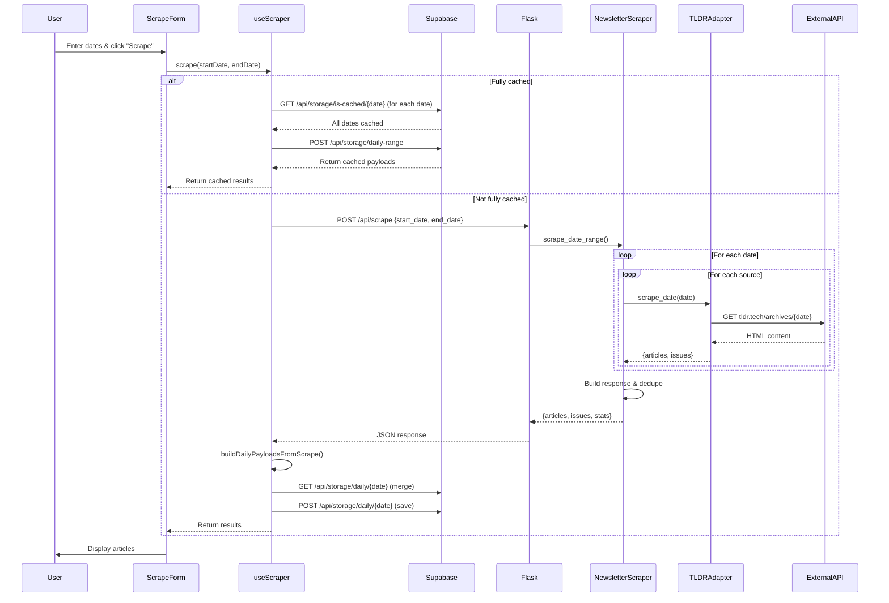

# Server: Scraping Pipeline

[→ Client: Feed Loading](../client/feed-loading.md) | [→ State Machines: Feed & Storage](../state-machines/feed-and-storage.md)

### Feature 1: Newsletter Scraping - Complete Flow

#### Client → Backend → External Services

```
User clicks "Scrape Newsletters"
  │
  ├─ ScrapeForm.jsx handleSubmit()
  │    │
  │    ├─ Check validation
  │    │    │
  │    │    └─ If invalid: return early
  │    │
  │    └─ Call scraper.scrape(startDate, endDate)
  │
  └─ scraper.js scrape(startDate, endDate)
       │
       ├─ Reset state:
       │    - loading.value = true
       │    - progress.value = 0
       │    - error.value = null
       │
       ├─ Step 1: Check cache
       │    │
  │    └─ scraper.js isRangeCached(startDate, endDate)
  │         │
  │         ├─ If today is in range:
  │         │    │
  │         │    └─ Return false immediately (bypass cache to trigger server union)
  │         │
  │         ├─ Compute date range for past dates only
  │         │
  │         └─ Check each date in Supabase:
  │              │
  │              └─ GET /api/storage/is-cached/{date}
  │                   │
  │                   ├─ If ALL dates fully cached
  │                   │    │
  │                   │    └─ scraper.js loadFromCache()
  │                   │         │
  │                   │         ├─ POST /api/storage/daily-range
  │                   │         ├─ Build stats: buildStatsFromPayloads()
  │                   │         │
  │                   │         └─ Return cached results
       │                   │
       │                   └─ If NOT fully cached
       │                        │
       │                        └─ Continue to API call...
       │
       ├─ Step 2: API Call
       │    │
       │    ├─ progress.value = 50
       │    │
       │    └─ window.fetch('/api/scrape', {
       │         method: 'POST',
       │         body: JSON.stringify({ start_date, end_date })
       │       })
       │         │
       │         └─ Server receives request...
       │              │
       │              ├─ serve.py:36 scrape_newsletters_in_date_range()
       │              │    │
       │              │    ├─ Extract request.get_json()
       │              │    │    - start_date: "2024-01-01"
       │              │    │    - end_date: "2024-01-03"
       │              │    │    - sources: null (optional)
       │              │    │
       │              │    └─ tldr_app.py scrape_newsletters(start_date, end_date, source_ids, excluded_urls=[])
       │              │         │
       │              │         └─ tldr_service.py scrape_newsletters_in_date_range()
       │              │              │
       │              │              ├─ Parse and validate date range (max 31 days)
       │              │              │
       │              │              └─ For each date in range (per-date cache logic):
       │              │                   │
       │              │                   ├─ PAST DATE + CACHED:
       │              │                   │    │
       │              │                   │    └─ storage_service.get_daily_payload(date)
       │              │                   │         → Use cached articles directly (no network)
       │              │                   │
       │              │                   ├─ PAST DATE + NOT CACHED:
       │              │                   │    │
       │              │                   │    └─ newsletter_scraper.scrape_date_range(date, date, ...)
       │              │                   │         → Scrape from sources, add to response
       │              │                   │
       │              │                   └─ TODAY:
       │              │                        │
       │              │                        ├─ Load cached articles from Supabase (if any)
       │              │                        ├─ Extract cached URLs to exclusion set
       │              │                        ├─ Scrape sources with cached URLs excluded
       │              │                        └─ Union: cached articles + newly scraped articles
       │              │
       │              │              newsletter_scraper.scrape_date_range():
       │              │                   │
       │              │                   └─ For each source_id in source_ids:
       │              │                             │
       │              │                             ├─ newsletter_scraper.py:231 _collect_newsletters_for_date_from_source()
       │              │                             │    │
       │              │                             │    ├─ newsletter_scraper.py:15 _get_adapter_for_source(config)
       │              │                             │    │    │
       │              │                             │    │    └─ Factory returns adapter based on source_id:
       │              │                             │    │         - tldr_* → TLDRAdapter
       │              │                             │    │         - hackernews → HackerNewsAdapter
       │              │                             │    │         - trendshift → TrendshiftAdapter (Playwright-based)
       │              │                             │    │         - 20 other sources → respective adapters
       │              │                             │    │
       │              │                             │    └─ adapter.scrape_date(date, excluded_urls)
       │              │                             │         │
       │              │                             │         ├─ TLDRAdapter: Scrapes tldr.tech archives
       │              │                             │         │    │
       │              │                             │         │    ├─ Build URL: f"https://tldr.tech/{newsletter_type}/archives/{date}"
       │              │                             │         │    ├─ HTTP GET request
       │              │                             │         │    ├─ Parse HTML for articles
       │              │                             │         │    ├─ Extract metadata from titles: "(N minute read)" or "(GitHub Repo)" → article_meta field
       │              │                             │         │    ├─ Filter out excluded URLs
       │              │                             │         │    │
       │              │                             │         │    └─ Return { articles: [...], issues: [...] }
       │              │                             │         │
       │              │                             │         └─ HackerNewsAdapter: Scrapes HN API (Algolia)
       │              │                             │              │
       │              │                             │              ├─ Fetch 50 stories from Algolia (pre-filtered by date/score)
       │              │                             │              ├─ Filter out excluded URLs (canonical matching)
       │              │                             │              ├─ Calculate leading scores: (2 × upvotes) + comments
       │              │                             │              ├─ Sort by leading score descending
       │              │                             │              ├─ Convert top stories to articles
       │              │                             │              ├─ Extract metadata: "N upvotes, K comments" → article_meta field
       │              │                             │              │
       │              │                             │              └─ Return { articles: [...], issues: [] }
       │              │                             │
       │              │                             ├─ For each article in result:
       │              │                             │    │
       │              │                             │    ├─ Canonicalize URL
       │              │                             │    ├─ Deduplicate via url_set
       │              │                             │    │
       │              │                             │    └─ Append to all_articles
       │              │                             │
       │              │                             └─ Sleep 0.2s (rate limiting)
       │              │
       │              ├─ newsletter_scraper.py:198 _build_scrape_response()
       │              │    │
       │              │    ├─ Group articles by date
       │              │    ├─ Build markdown output (newsletter_merger.py)
       │              │    ├─ Build issues list
       │              │    ├─ Compute stats
       │              │    │
       │              │    └─ Return {
       │              │         success: true,
       │              │         articles: [...],
       │              │         issues: [...],
       │              │         stats: { total_articles, unique_urls, ... }
       │              │       }
       │              │
       │              └─ Flask jsonify() → HTTP Response
       │
       ├─ Step 3: Process Response
       │    │
  │    └─ scraper.js buildDailyPayloadsFromScrape(data)
  │         │
  │         ├─ Group articles by date
  │         ├─ Group issues by date
  │         │
  │         └─ Build daily payloads: [{
  │              date: "2024-01-01",
  │              articles: [...],
  │              issues: [...]
  │            }]
  │
  ├─ Step 4: Merge with Cache
  │    │
  │    └─ scraper.js mergeWithCache(payloads)
  │         │
  │         └─ For each payload:
  │              │
  │              ├─ GET /api/storage/daily/{date}
  │              │    │
  │              │    ├─ If cached data exists:
  │              │    │    │
  │              │    │    └─ Merge articles (preserve summary, read, removed)
  │              │    │
  │              │    └─ POST /api/storage/daily/{date} (save to Supabase)
  │              │
  │              └─ Return merged payload
  │
  ├─ Step 5: Update State
  │    │
  │    ├─ Update progress state
  │    ├─ Set results state: { success, payloads, source, stats }
  │    │
  │    └─ Return results
  │
  └─ Step 6: Display Results
       │
       └─ ScrapeForm.jsx passes results via callback
            │
            └─ App.jsx handleResults(data)
                 │
                 ├─ Update results state
                 │
                 └─ ResultsDisplay.jsx renders:
                      │
                      ├─ Stats
                      ├─ Debug logs
                      │
                      └─ ArticleList (grouped by date/issue)
                           │
                           └─ ArticleCard (for each article)
```

---

## Sequence Diagram: Full Scraping Flow



---
